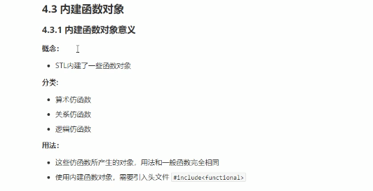
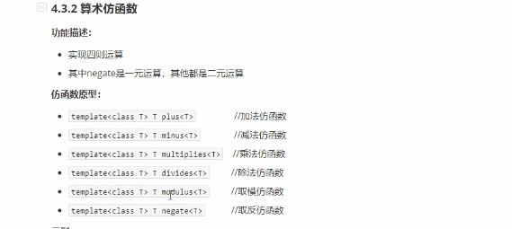
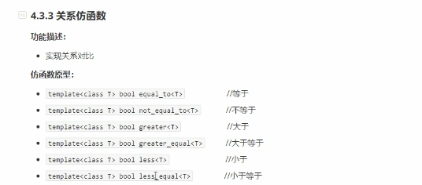
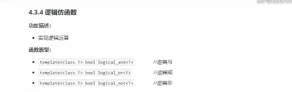
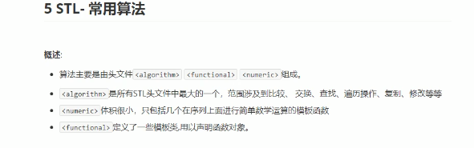
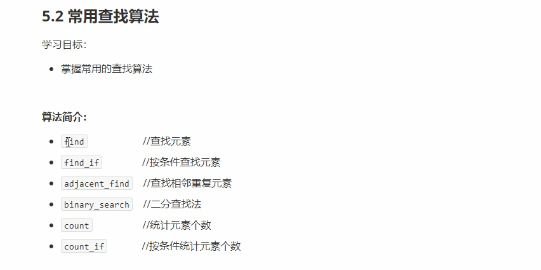
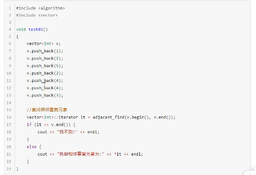
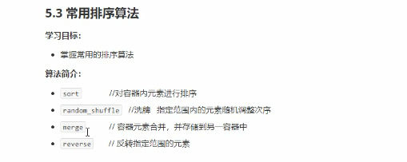
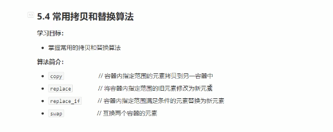

函数对象


<!--more-->

```c++
#include<iostream>

using namespace std;

class myAdd{ // 函数对象 
	public:
		myAdd(){
			this->count=0;
		}
		int operator()(int a,int b){
			this->count++;
			return a+b;
		} 
		//使用属性记录对象调用次数
		int count; 
};
void test1(){
	myAdd myadd;
	cout<< myadd(12,43) <<endl;
	cout<< myadd(12,43) <<endl;
	cout<<myadd.count<<endl; // 2
}
 // 可以作为参数传递
void doAdd(myAdd &myadd,int a,int b){
	cout<<myadd(a,b)<<endl;
}
void  test2(){
	myAdd myadd;
	doAdd(myadd,12,44);
}
int main(){
	//test1();
	test2();
} 
```

谓词

```c++
#include<iostream>
#include<algorithm>
#include<vector>
using namespace std;


// 仿函数 返回值是bool类型, 成为谓词 
// 一元谓词 ,接收一个参数 
class GreatorFind{
	public:
		bool operator()(int val){ // 一元谓词 
			return val>5;
		}

}; 
class myCompare{
	public:
		bool operator()(int a,int b){ // 二元谓词 谓词指的是返回bool 二元指的是参数
			return a>b;
		}
}; 


void test(){
	vector<int> v;
	for(int i=0;i<10;i++){
		v.push_back(i);
	}
	vector<int>::iterator it=find_if(v.begin(),v.end(),GreatorFind());
	cout<<*it<<endl;
	sort(v.begin(),v.end(),myCompare());
	for(vector<int>::iterator it=v.begin();it!=v.end();it++){
		cout<<*it<<" ";
	} 
}

/*
6
9 8 7 6 5 4 3 2 1 0
*/
 
 
int main(){
	test();
}
```

内建仿函数





关系仿函数



逻辑仿函数



```c++
#include<iostream>
#include<functional> // 算数仿函数头文件
#include<vector>
#include<algorithm> 
using namespace std;


void test1(){
	plus<int> p;
	negate<int> n; 
	cout<<p(12,43)<<endl; // 不支持匿名 
	cout<<n(129)<<endl; //取反 
	vector<int> v;
	for(int i=0;i<9;i++){
		v.push_back(i);
	}
	sort(v.begin(),v.end(),greater<int>()); //关系仿函数  
	for(vector<int>::iterator it=v.begin();it!=v.end();it++){
		cout<<*it<<" ";  
	}
	cout<<endl; 
	// 逻辑运算符
	vector<bool> v1;
	v1.push_back(true);
	vector<bool> v2;
	v2.resize(v1.size());
	transform(v1.begin(),v1.end(),v2.begin(),logical_not<bool>());
	for(vector<bool>::iterator it=v2.begin();it!=v2.end();it++){
		cout<<*it<<" ";  
	}
}

/*
55
-129
8 7 6 5 4 3 2 1 0
0
*/

int main(){
	test1();
} 
```

常用算法



常用的遍历算法

```
for_each(begin,end,func)
transform()
```





```c++
#include<iostream>
#include<algorithm>
#include<vector>
using namespace std;

class print1{
	public:
		void operator()(int val){
			cout<<val<<" ";
		}
};
class Person{
	public:
		string name;
		int age;
		Person(string name,int age){
			this->age=age;
			this->name=name;
		}
		bool operator==(const Person&p){ //比较规则 
			if(this->name==p.name&&this->age==p.age){
				return true;
			}else{
				return false;
			}
		}
}; 
void print(int val){
	cout<< val <<" "; 
}
void test1(){
	// for_each
	vector<int> v;
	for(int i=0;i<9;i++){
		v.push_back(i);
	}
	
	for_each(v.begin(),v.end(),print); //遍历
	cout<<endl;
	for_each(v.begin(),v.end(),print1()); //遍历
	cout<<endl;	
	//常用的查找算法
	// find
	vector<Person> p;
	Person p1("12",32);
	Person p2("43",32);
	Person p3("45",32);
	p.push_back(p1);
	p.push_back(p2);
	p.push_back(p3);
	vector<int>::iterator it=find(v.begin(),v.end(),5); // 必返回一个迭代器,如果没找到,就返回end 
	cout<<*it<<endl; 
	vector<Person>::iterator itp=find(p.begin(),p.end(),p1); //查找自定义数据类型 
	cout<<itp->name<<" "<<itp->age<<endl;
	cout<<endl;
	// find_if
	// adjacent_find 查找相邻重复的元素
	// binary_search 二分查找 返回值是true 和false  查找的元素必须为有序序列 
	cout<<binary_search(v.begin(),v.end(),6)<<endl; 
	// count 统计 
	cout<<count(v.begin(),v.end(),1)<<endl;
	// count_if
	 
	
	 
}

int main(){
	test1();
} 
```




```c++
#include<iostream>
#include<vector>
#include<algorithm>
#include<ctime>
using namespace std;


void print(int val){
	cout<<val<<" ";
}

void test(){
	vector<int> v;
	for(int i=0;i<9;i++){
		v.push_back(i);
	}
	vector<int>  v2;
	for(int i=0;i<4;i++){
		v2.push_back(i);
	}
	vector<int> v3;
	v3.resize(v.size()+v2.size());
	merge(v.begin(),v.end(),v2.begin(),v2.end(),v3.begin()); // merge 合并, 将两个容器合并放到第三个容器中. 且两个容器是有序的,合并后也是有序的 
	for_each(v3.begin(),v3.end(),print);  
	cout<<endl;
	reverse(v.begin(),v.end());
	for_each(v.begin(),v.end(),print);
	cout<<endl;
	random_shuffle(v.begin(),v.end()); // random_shuffle 洗牌,将有序变无序 
	for_each(v.begin(),v.end(),print);
	cout<<endl; 
	
}
int main(){
	srand((unsigned int)time(NULL));
	test();
} 
```



copy算法

replace替换,将所有相同的都替换

swap交换同种类型的容器

```c++
	// copy(v.begin(),v.end(),v2.begin()); copy 
	vector<int> v;
	v.push_back(10);
	v.push_back(23);
	v.push_back(23);
	vector<int> v2;
	v2.resize(v.size());
	copy(v.begin(),v.end(),v2.begin());
	for_each(v2.begin(),v2.end(),print);
		// replace;
	replace(v.begin(),v.end(),23,2000);
	copy(v.begin(),v.end(),v2.begin());
	for_each(v2.begin(),v2.end(),print);
```

算术生成算法

```c++
#include<iostream>
#include<vector>
using namespace std;
#include<numeric> // 头文件 

void test(){
	vector<int>v;
	for(int i=0;i<=100;i++){
		v.push_back(i);
	}
	// 第三个参数是累加起始值. 
	cout<<accumulate(v.begin(),v.end(),0)<<endl;
	// fill() 填充新值
	//fill()
	 
}
int main(){
	test();
} 
```

集合算法


```c++
#include<iostream>
#include<vector>
#include<algorithm>
using namespace std;

void print(int val){
	cout<<val<<" ";
}
void test(){
	vector<int> v;
	vector<int> v2;
	vector<int> v3;
	for(int i=0;i<10;i++){
		v.push_back(i);
		v2.push_back(i+5);
	} 
	v3.resize(min(v.size(),v2.size()));
	// 交集 
	vector<int>::iterator it=set_intersection(v.begin(),v.end(),v2.begin(),v2.end(),v3.begin());
	for_each(v3.begin(),it,print); // 注意 
	cout<<endl; 
	// 并集
	v3.resize(v.size()+v2.size());
	vector<int>::iterator vit=set_union(v.begin(),v.end(),v2.begin(),v2.end(),v3.begin());
	for_each(v3.begin(),vit,print); // 注意 
	cout<<endl;
	// 补集
	v3.resize(max(v.size(),v2.size()));
	vector<int>::iterator vdit=set_difference(v.begin(),v.end(),v2.begin(),v2.end(),v3.begin());
	for_each(v3.begin(),vdit,print); // 注意 
	cout<<endl;
		v3.resize(max(v.size(),v2.size()));
	vector<int>::iterator vmaxit=set_difference(v2.begin(),v2.end(),v.begin(),v.end(),v3.begin());
	for_each(v3.begin(),vmaxit,print); // 注意 
	cout<<endl;
}

/*
5 6 7 8 9
0 1 2 3 4 5 6 7 8 9 10 11 12 13 14
0 1 2 3 4
10 11 12 13 14
*/

int main(){
	test();
} 
```

