c++ 容器

<!--more-->

容器嵌套容器

```c++
#include<iostream>
#include<vector>
using namespace std;

void test(){
	vector<vector<int> >v; //这里右边>>必须分开写 
	vector<int> v1;
	vector<int> v2;
	for(int i=0;i<4;i++){
		v1.push_back(i);
		v2.push_back(i+1);
	}
	v.push_back(v1);
	v.push_back(v2);
	for(vector<vector<int> >::iterator it = v.begin();it!=v.end();it++){
		// *it 指的是vector<int>
		//再次遍历
		for(vector<int>::iterator vit=(*it).begin();vit!=(*it).end();vit++){
			cout<<*(vit)<<" ";
		} 
		cout<<endl;
	}
}

int main(){
	test();
} 
```

string字符串拼接

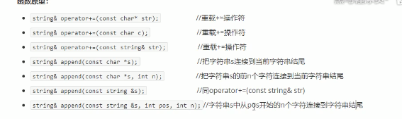

string 查找和替换

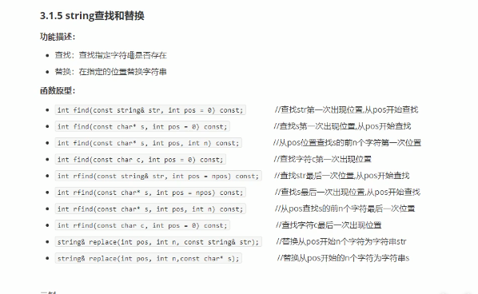

注意替换replace(),三个参数是指从第几个开始,替换几个,会将新的字符串全部加进去

如

```c++
string str="cd";
str.replace(1,3,"dasdddas")
 // cdasdddas
```

```c++
#include <iostream> 
using namespace std;

void test(){
	string str="hello";
	str.append("world"); //添加 
	str+="i";
	string str1="cdwewewf";
	str1.replace(1,3,"das"); //字符替换 
	cout<<str1;
	string str3="hello";
	string str2="xello" ;
	if(str3.compare(str2)==0){ //字符串比较 
		cout<<"相等"<<endl; 
	}
	else{
		cout<<"不相等"<<endl; 
	}
	
	//string字符存取
	string str4="hello";
	//访问字符
	for(int i=0;i<str4.size();i++){
		cout<<str4[i]<<" ";
	}
	cout<<endl; 
	for(int i=0;i<str4.size();i++){
		cout<<str4.at(i)<<" ";
	} 
	cout<<endl;
	// string 插入删除
	// insert()
	// erase(int pos,int n=npos);
	str2.erase(1,2);
	cout<<str2<<endl;
	// 子串
	// substr(int pos,int n=npos)
	 string str5=str3.substr(2,3);
	 cout<<str5<<endl;
	 
	 string email = "zhangsan@sina.com"; //截取邮箱 
	 int pos = email.find("@");
	 cout<<email.substr(0,pos)<<endl;
} 
int main(){
    test();
    
}
```

vector 容器 动态扩展

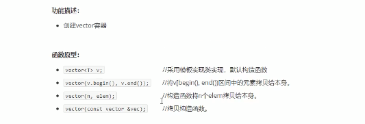

vector赋值操作

```c++
#include<iostream>

#include<vector>

using namespace std;

void printVector(vector<int> &v){
	for(vector<int>::iterator it=v.begin();it!=v.end();it++){
		cout<<*it<<" ";
	}
}
void test(){
	vector<int> v1;
	for(int i=0;i<4;i++){
		v1.push_back(i);
	}
	printVector(v1);
	vector<int> v2;
	v2=v1; //拷贝构造 
	printVector(v2);
	vector<int> v3;
	v3.assign(v1.begin(),v1.end());
	printVector(v3);
	vector<int> v4;
	v4.assign(10,100); //赋值 
	printVector(v4);
}

int main(){
	test();
} 
```

vector容量和大小

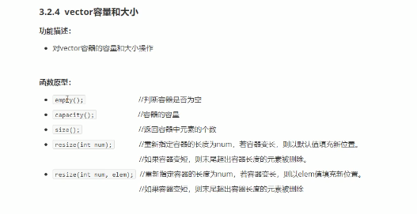

插入和删除


```c++
#include<iostream>

#include<vector>

using namespace std;


void printVector(vector<int>&v){
	for(vector<int>::iterator it=v.begin();it!=v.end();it++){
		cout<<*it<<" ";
	}
	cout<<endl;
}
void test(){
	vector<int> v1;
	cout<<v1.capacity()<<endl;// 为空的时候 容量为0 
	v1.push_back(1);
	v1.push_back(2);
	v1.push_back(3);
	cout<<v1.capacity()<<endl;//
	 // 插入和删除
	// 尾删
	printVector(v1);
	v1.pop_back();
	printVector(v1);
	// insert()
	v1.insert(v1.begin(),100);
	printVector(v1);
	v1.insert(v1.begin(),2,1000);
	printVector(v1);
	v1.erase(v1.begin());
	printVector(v1);
	v1.erase(v1.begin(),v1.end()); //相等于清空 
	printVector(v1);
	v1.clear(); //清空 
}
int main(){
	test();
} 
```


```c++
#include<iostream>
#include<vector>
using namespace std;

void printVector(vector<int> &v1){
	for(vector<int>::iterator it=v1.begin();it!=v1.end();it++){
		cout<<*it<<" "; 
	} 
	cout<<endl;
}
void test(){
	vector<int> v1;
	vector<int> v2;
	for(int i=0;i<10;i++){
		v1.push_back(i);
	}
	for(int i=10;i>0;i--){
		v2.push_back(i);
	}
	//cout<<*v1<<endl; // 不被允许 
	// 数组方式遍历vector
	for(int i=0;i<v1.size();i++){
		cout<<v1[i]<<" ";
	} 
	cout<<endl;
	for(int i=0;i<v1.size();i++){
		cout<<v1.at(i)<<" ";
	}
	cout<<endl;
	// 获取第一个元素
	cout<<v1.front()<<endl; 
	//互换容器
	v1.swap(v2);
	printVector(v1);
	printVector(v2);
	 // 实际用途,收缩内存空间 
	vector<int> v4;
	
	//使用reserve预留空间,可以减少内存开辟次数
	v4.reserve(100000); 
	int num=0; 
	int *p=NULL;  
	for(int i=0;i<100000;i++){
	 	v4.push_back(i);
	 	if(p!=&v4[0]){
	 		p=&v4[0];
	 		num++;
		 }
	} 
	cout<<num<<endl; //num 用来统计开辟了多少次内存  18 次 
	cout<<v4.capacity()<<endl;
	v4.resize(3);
	vector<int>(v4).swap(v4); //匿名对象 ,回收内存 
	cout<<v4.capacity()<<endl;
	// 预留空间
	 
}

int main(){
	test();
} 
```

deque 双端数组

与vector的区别

vector对于头部的插入删除效率低,数据量越大,效率越低

deque相对而言,对头部的插入删除速度比vector快

vector访问元素的速度会比deque快

deque内部工作原理,deque内部有中控器,维护每段缓冲区的内容,缓冲区中存放真实数据

中控器维护的是每一个缓冲区的地址,是的每个deque像一片连续的地址

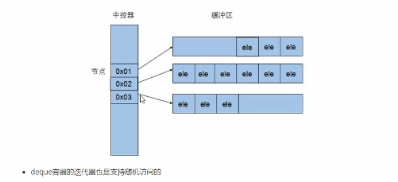

注意: deque没有容量的概念

判断为空---empty

返回元素个数----size

重新指定个数----resize


```c++
#include<iostream>
#include<deque>
#include<algorithm>
using namespace std;
// deque容器的插入和删除 
void printDeque(const deque<int>&d){
	for(deque<int>::const_iterator it=d.begin();it!=d.end();it++){
		cout<<*it<<" ";	
	}
	cout<<endl;
}
void test(){
	deque<int> d;
	d.push_back(12);
	d.push_back(100);
	d.push_front(120);
	printDeque(d);
	// 尾删
	d.pop_back();
	d.pop_front();
	printDeque(d);
	// 指定位置插入删除
	d.insert(d.begin(),10000);
	printDeque(d); 
	// 在指定区间
	deque<int> d2;
	d2.push_back(1);
	d2.push_back(2);
	d2.push_back(3);
	// 
	d.insert(d.begin(),d2.begin(),d2.end());
	
	printDeque(d); 
	
	// 删除
	d.erase(d.begin());
	deque<int>::iterator it=d.begin();
	it++;
	d.erase(it); 
	printDeque(d);
	sort(d.begin(),d.end()); // 排序算法
	printDeque(d);
}
/*
120 12 100
12
10000 12
1 2 3 10000 12
2 10000 12
2 12 10000
*/

int main(){
	test();
} 
```

案例

```c++
#include<iostream>
#include<deque>
#include<vector>
#include<algorithm>
#include<ctime>
using namespace std;
class Person{
	public:
		string name;
		int score;
		Person(string name,int score){
			this->name=name;
			this->score=score;
		}
};
void print(const vector<Person>&v){
	for(vector<Person>::const_iterator it=v.begin();it!=v.end();it++){
		cout<<(*it).name<<":"<<"分数"<<(*it).score<<endl;
	}
	cout<<endl;
}
void createPerson(vector<Person> &v){
	string stringSeed="ABCDE";
	int score=0;
	for(int i=0;i<5;i++){
		string name ="选手";
		name+=stringSeed[i];
		Person p(name,score);
		v.push_back(p); //创建5名对象 
	}
}

void setScore(vector<Person>&v){
	for(vector<Person>::iterator it=v.begin();it!=v.end();it++){
		deque<int> d;
		for(int i=0;i<10;i++){
			int score=rand()%41+60; //60-100
			d.push_back(score);
			cout<<(*it).name<<":"<<score<<" ";
		}
		cout<<endl;
		sort(d.begin(),d.end()); // 排序
		d.pop_front();
		d.pop_back(); //去掉分数
		int sum=0;
		for(deque<int>::iterator it=d.begin();it!=d.end();it++){
			sum+=*it;
		}
		(*it).score=sum/d.size();
	}
} 

int main(){
	//随机数种子
	srand((unsigned int)time(NULL)); 
	// 创建5名选手
	vector<Person> v;
	createPerson(v);
	// 给5名选手打分
	setScore(v);
	//  
	print(v);
	cout<<rand()<<endl;
} 
```

stack容器

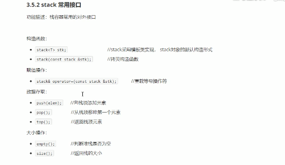

queue容器

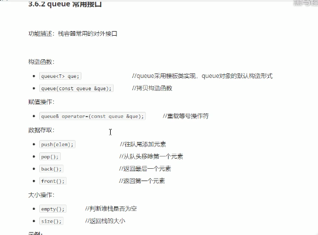

list容器

list赋值和交换

```c++
#include<iostream>
#include<list>

using namespace std;

void printList(const list<int>&L){
	
	for(list<int>::const_iterator it=L.begin();it!=L.end();it++){
		cout<<*it<<" ";
	}
	cout<<endl;
} 

void test(){
	list<int> L1;
	list<int> L2;
	L1.push_back(100);
	L1.push_back(20);
	L1.push_back(12);
	L2.assign(10,100);
	printList(L1);
	printList(L2);
	L1.swap(L2); //交换 
	printList(L1);
	printList(L2);
}
int main(){
	test();
} 
```


list排序案例

```c++
#include<iostream>
#include<list>

using namespace std;
// list 容器的排序案例 
class Person{
	public:
		int age;
		string name;
		int height;
		Person(string name,int age, int height){
			this->name=name;
			this->age=age;
			this->height=height;
		}
	    
		
};
void printPerson(const list<Person>&L){
	for(list<Person>::const_iterator it=L.begin();it!=L.end();it++){
		cout<<(*it).name<<" "<<(*it).age<<" "<<(*it).height<<endl; 
	}
	cout<<endl;
}
bool myCompare(Person &p1, Person &p2 ){ // 自定义数据类型的排序规则 
	if(p1.age==p2.age){
		return p1.height<p2.height;
	}
	return p1.age<p2.age;
}
void test(){
	list<Person> L;
	L.push_back(Person("zhangsan",23,180));
	L.push_back(Person("lisi",43,290));
	L.push_back(Person("wangwu",43,90));
	
	// 容器用年龄排序,如果年龄相同,用身高排序
	printPerson(L);

	
	L.sort(myCompare);
	
	printPerson(L);
} 

int main(){
	test();
}
 
```

set集合(没有重复元素,并且自动排序)

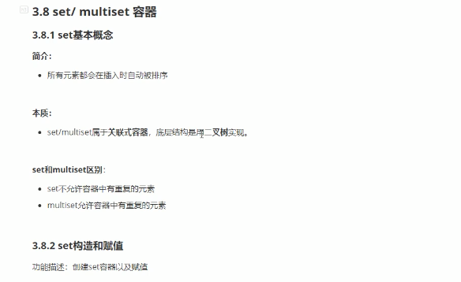

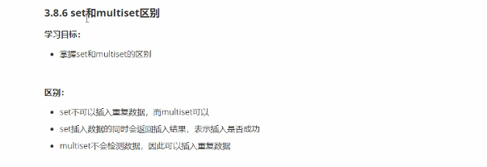

```c++
#include<iostream>
#include<set>

using namespace std;


void printSet(const set<int> &s){
	for(set<int>::const_iterator it=s.begin();it!=s.end();it++){
		cout<<*it<<" ";
	}
	cout<<endl;
} 
void test(){
	set<int> s;
	s.insert(23);
	s.insert(43);
	printSet(s);
	// find 返回迭代器
	if(s.find(43)!=s.end()){
		cout<<*(s.find(43))<<endl; // 返回迭代器 *(s.find(23))
	} 
	cout<<s.count(23)<<endl; 
}
int main(){
	test();
} 
```

pair对组(和元组很像)

paie的创建方式

```c++
	pair<string,int>p("tom",23);
	pair<string,int> p2 =make_pair("zhangsan",43);
```

利用仿函数重载排序规则

```c++
class compare{
	public:
		bool operator()(int v1,int v2){
			return v1>v2;
		}
		
	
};
	set<int,compare> s;
	s.insert(23);
	s.insert(43);
	for(set<int,compare>::iterator it=s.begin();it!=s.end();it++){
		cout<<*it<<" ";
	}
```

map容器(高效率)(会按照key排序)

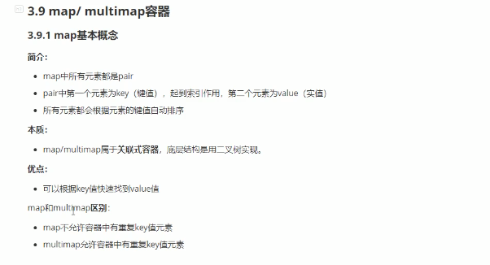

```c++
	map<string,int> m;
	m.insert(pair<string,int>("zhangsan",23));
	m.insert(pair<string,int>("lisi",34));
	m.insert(pair<string,int>("wangwu",343));
	m.insert(make_pair("wangmazi",89));
	m.insert(map<string,int>::value_type("啦啦啦",43));
	cout<<m["zhangsan"]<<endl; // 中括号适合访问,不适合插入
	for(map<string,int>::iterator it=m.begin();it!=m.end();it++){
		cout<<it->first<<it->second<<endl;
	}
```

员工分类案例

```c++
#include<iostream>
#include<vector>
#include<map> 
#include <cstdio>
#include <cstdlib>
#include<ctime>
using namespace std;
/*
	有十个员工,将这些员工随机分配到每个岗位,然后输出每个岗位的人员信息
	将10个人放在vector中,然后遍历vector将人随机分配到multimap的容器中
	分部门显示员工信息
	 
	

*/
class Worker{
	public:
		string name;
		int Salary;
//		Worker(string name,int Salary){
//			this->name=name;
//			this->Salary=Salary;
//		}
};


void createWorker(vector<Worker> &worker){
	string name_seed = "ABCDEFGHIJ"; 
	for(int i=0;i<10;i++){
		Worker w;
		w.name="员工";
		w.name+=name_seed[i];
		w.Salary= rand()%10000+10000; // 坑 , 一句还执行不了  worker.push_back(Worker("员工"+name_seed[i],rand()%10000+10000));
		worker.push_back(w); // 10000-19999
	}
	
//	for(vector<Worker>::iterator it=worker.begin();it!=Worker.end();it++){
//		itWorker()
//	}
}
void printVector(vector<Worker> &worker){
	for(vector<Worker>::iterator it=worker.begin();it!=worker.end();it++){
		cout<<"姓名:"<< it->name<<" "<<"工资:"<<it->Salary<<endl;
	}	
}
void setGroup(vector<Worker> &worker,multimap<int,Worker> &mworker){
	for(vector<Worker>::iterator it=worker.begin();it!=worker.end();it++){
		int dept = rand()%3; // 0 1 2 
		mworker.insert(make_pair(dept,*it));
	}
}
void printMworker(multimap<int,Worker>&worker){ //  0 A B C  1 F G  2 D E 
	cout<<"美术--------------"<<endl;	
	for(multimap<int,Worker>::iterator it=worker.begin();it!=worker.end();it++){
		if((*it).first==0){	
			cout<<"姓名:"<< it->second.name<<" "<<"工资:"<< it->second.Salary<<endl;
			
		}
	} 
	cout<<"设计--------------"<<endl;	
	for(multimap<int,Worker>::iterator it=worker.begin();it!=worker.end();it++){
		if((*it).first==1){	
			cout<<"姓名:"<< it->second.name<<" "<<"工资:"<< it->second.Salary<<endl;
			
		}
	} 
	cout<<"开发---------------"<<endl;	
	for(multimap<int,Worker>::iterator it=worker.begin();it!=worker.end();it++){
		if((*it).first==2){	
			cout<<"姓名:"<< it->second.name<<" "<<"工资:"<< it->second.Salary<<endl;		
		}	
	}
}
int main(){
	srand((unsigned int )time(NULL));
	vector<Worker> vWorker;
	createWorker(vWorker);
	printVector(vWorker);
	// 员工分组
	multimap<int,Worker> mWorker;
	setGroup(vWorker,mWorker);
	printMworker(mWorker);
	
}

/*
姓名:员工A 工资:15799
姓名:员工B 工资:19029
姓名:员工C 工资:14589
姓名:员工D 工资:11870
姓名:员工E 工资:11106
姓名:员工F 工资:16145
姓名:员工G 工资:12290
姓名:员工H 工资:15171
姓名:员工I 工资:13026
姓名:员工J 工资:19923
美术--------------
姓名:员工B 工资:19029
姓名:员工C 工资:14589
姓名:员工D 工资:11870
姓名:员工F 工资:16145
设计--------------
姓名:员工A 工资:15799
姓名:员工E 工资:11106
姓名:员工J 工资:19923
开发---------------
姓名:员工G 工资:12290
姓名:员工H 工资:15171
姓名:员工I 工资:13026
*/ 
```

函数对象

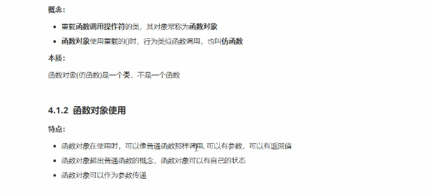

```c++
#include<iostream>

using namespace std;

class myAdd{ // 函数对象 
	public:
		myAdd(){
			this->count=0;
		}
		int operator()(int a,int b){
			this->count++;
			return a+b;
		} 
		//使用属性记录对象调用次数
		int count; 
};
void test1(){
	myAdd myadd;
	cout<< myadd(12,43) <<endl;
	cout<< myadd(12,43) <<endl;
	cout<<myadd.count<<endl; // 2
}
 // 可以作为参数传递
void doAdd(myAdd &myadd,int a,int b){
	cout<<myadd(a,b)<<endl;
}
void  test2(){
	myAdd myadd;
	doAdd(myadd,12,44);
}
int main(){
	//test1();
	test2();
} 
```

谓词

```c++
#include<iostream>
#include<algorithm>
#include<vector>
using namespace std;


// 仿函数 返回值是bool类型, 成为谓词 
// 一元谓词 ,接收一个参数 
class GreatorFind{
	public:
		bool operator()(int val){ // 一元谓词 
			return val>5;
		}

}; 
class myCompare{
	public:
		bool operator()(int a,int b){ // 二元谓词 谓词指的是返回bool 二元指的是参数
			return a>b;
		}
}; 


void test(){
	vector<int> v;
	for(int i=0;i<10;i++){
		v.push_back(i);
	}
	vector<int>::iterator it=find_if(v.begin(),v.end(),GreatorFind());
	cout<<*it<<endl;
	sort(v.begin(),v.end(),myCompare());
	for(vector<int>::iterator it=v.begin();it!=v.end();it++){
		cout<<*it<<" ";
	} 
}

/*
6
9 8 7 6 5 4 3 2 1 0
*/
 
 
int main(){
	test();
}
```

内建仿函数

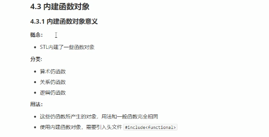

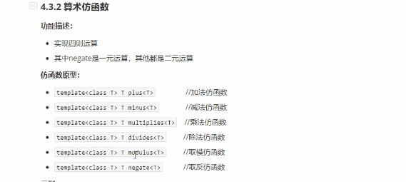

关系仿函数


逻辑仿函数


```c++
#include<iostream>
#include<functional> // 算数仿函数头文件
#include<vector>
#include<algorithm> 
using namespace std;


void test1(){
	plus<int> p;
	negate<int> n; 
	cout<<p(12,43)<<endl; // 不支持匿名 
	cout<<n(129)<<endl; //取反 
	vector<int> v;
	for(int i=0;i<9;i++){
		v.push_back(i);
	}
	sort(v.begin(),v.end(),greater<int>()); //关系仿函数  
	for(vector<int>::iterator it=v.begin();it!=v.end();it++){
		cout<<*it<<" ";  
	}
	cout<<endl; 
	// 逻辑运算符
	vector<bool> v1;
	v1.push_back(true);
	vector<bool> v2;
	v2.resize(v1.size());
	transform(v1.begin(),v1.end(),v2.begin(),logical_not<bool>());
	for(vector<bool>::iterator it=v2.begin();it!=v2.end();it++){
		cout<<*it<<" ";  
	}
}

/*
55
-129
8 7 6 5 4 3 2 1 0
0
*/

int main(){
	test1();
} 
```

常用算法


常用的遍历算法

```
for_each(begin,end,func)
transform()
```


```c++
#include<iostream>
#include<algorithm>
#include<vector>
using namespace std;

class print1{
	public:
		void operator()(int val){
			cout<<val<<" ";
		}
};
class Person{
	public:
		string name;
		int age;
		Person(string name,int age){
			this->age=age;
			this->name=name;
		}
		bool operator==(const Person&p){ //比较规则 
			if(this->name==p.name&&this->age==p.age){
				return true;
			}else{
				return false;
			}
		}
}; 
void print(int val){
	cout<< val <<" "; 
}
void test1(){
	// for_each
	vector<int> v;
	for(int i=0;i<9;i++){
		v.push_back(i);
	}
	
	for_each(v.begin(),v.end(),print); //遍历
	cout<<endl;
	for_each(v.begin(),v.end(),print1()); //遍历
	cout<<endl;	
	//常用的查找算法
	// find
	vector<Person> p;
	Person p1("12",32);
	Person p2("43",32);
	Person p3("45",32);
	p.push_back(p1);
	p.push_back(p2);
	p.push_back(p3);
	vector<int>::iterator it=find(v.begin(),v.end(),5); // 必返回一个迭代器,如果没找到,就返回end 
	cout<<*it<<endl; 
	vector<Person>::iterator itp=find(p.begin(),p.end(),p1); //查找自定义数据类型 
	cout<<itp->name<<" "<<itp->age<<endl;
	cout<<endl;
	// find_if
	// adjacent_find 查找相邻重复的元素
	// binary_search 二分查找 返回值是true 和false  查找的元素必须为有序序列 
	cout<<binary_search(v.begin(),v.end(),6)<<endl; 
	// count 统计 
	cout<<count(v.begin(),v.end(),1)<<endl;
	// count_if
	 
	
	 
}

int main(){
	test1();
} 
```


```c++
#include<iostream>
#include<vector>
#include<algorithm>
#include<ctime>
using namespace std;


void print(int val){
	cout<<val<<" ";
}

void test(){
	vector<int> v;
	for(int i=0;i<9;i++){
		v.push_back(i);
	}
	vector<int>  v2;
	for(int i=0;i<4;i++){
		v2.push_back(i);
	}
	vector<int> v3;
	v3.resize(v.size()+v2.size());
	merge(v.begin(),v.end(),v2.begin(),v2.end(),v3.begin()); // merge 合并, 将两个容器合并放到第三个容器中. 且两个容器是有序的,合并后也是有序的 
	for_each(v3.begin(),v3.end(),print);  
	cout<<endl;
	reverse(v.begin(),v.end());
	for_each(v.begin(),v.end(),print);
	cout<<endl;
	random_shuffle(v.begin(),v.end()); // random_shuffle 洗牌,将有序变无序 
	for_each(v.begin(),v.end(),print);
	cout<<endl; 
	
}
int main(){
	srand((unsigned int)time(NULL));
	test();
} 
```


copy算法

replace替换,将所有相同的都替换

swap交换同种类型的容器

```c++
	// copy(v.begin(),v.end(),v2.begin()); copy 
	vector<int> v;
	v.push_back(10);
	v.push_back(23);
	v.push_back(23);
	vector<int> v2;
	v2.resize(v.size());
	copy(v.begin(),v.end(),v2.begin());
	for_each(v2.begin(),v2.end(),print);
		// replace;
	replace(v.begin(),v.end(),23,2000);
	copy(v.begin(),v.end(),v2.begin());
	for_each(v2.begin(),v2.end(),print);
```

算术生成算法

```c++
#include<iostream>
#include<vector>
using namespace std;
#include<numeric> // 头文件 

void test(){
	vector<int>v;
	for(int i=0;i<=100;i++){
		v.push_back(i);
	}
	// 第三个参数是累加起始值. 
	cout<<accumulate(v.begin(),v.end(),0)<<endl;
	// fill() 填充新值
	//fill()
	 
}
int main(){
	test();
} 
```

集合算法

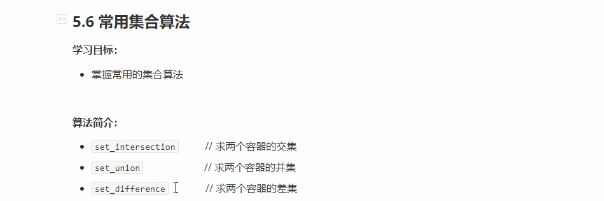

```c++
#include<iostream>
#include<vector>
#include<algorithm>
using namespace std;

void print(int val){
	cout<<val<<" ";
}
void test(){
	vector<int> v;
	vector<int> v2;
	vector<int> v3;
	for(int i=0;i<10;i++){
		v.push_back(i);
		v2.push_back(i+5);
	} 
	v3.resize(min(v.size(),v2.size()));
	// 交集 
	vector<int>::iterator it=set_intersection(v.begin(),v.end(),v2.begin(),v2.end(),v3.begin());
	for_each(v3.begin(),it,print); // 注意 
	cout<<endl; 
	// 并集
	v3.resize(v.size()+v2.size());
	vector<int>::iterator vit=set_union(v.begin(),v.end(),v2.begin(),v2.end(),v3.begin());
	for_each(v3.begin(),vit,print); // 注意 
	cout<<endl;
	// 补集
	v3.resize(max(v.size(),v2.size()));
	vector<int>::iterator vdit=set_difference(v.begin(),v.end(),v2.begin(),v2.end(),v3.begin());
	for_each(v3.begin(),vdit,print); // 注意 
	cout<<endl;
		v3.resize(max(v.size(),v2.size()));
	vector<int>::iterator vmaxit=set_difference(v2.begin(),v2.end(),v.begin(),v.end(),v3.begin());
	for_each(v3.begin(),vmaxit,print); // 注意 
	cout<<endl;
}

/*
5 6 7 8 9
0 1 2 3 4 5 6 7 8 9 10 11 12 13 14
0 1 2 3 4
10 11 12 13 14
*/

int main(){
	test();
} 
```

