C语言用三种方式打印数组

<!--more-->

```c
#include<stdio.h>
void pointarray2(int a[]){//用指针变量指向数组元素
	int *point;
	int i;
	for(i=0;i<10;i++){
		point=&a[i];
		printf("%d",*point);
	}
	printf("\n");
}
void pointarray(int a[]){//通过数组名计算数组的元素地址,找出元素的值
	int *point;
	int i;
	point=a;
	for(i=0;i<10;i++){
		printf("%d",*(point+i));
	}
	printf("\n");
}

int main(){
	int a[10]={9,8,7,6,5,4,3,2,1,0};
	int i;
	for(i=0;i<10;i++){//下标法
		printf("%d",a[i]);
	}
	printf("\n");
	pointarray(a);
	pointarray2(a);
	return 0;
}
```

实现数组倒序存储

```c
#include<stdio.h>
void swap(int *p1,int *p2){
	int temp;
	temp=*p1;
	*p1=*p2;
	*p2=temp;
}
void reverse(int a[],int n){
	int i;
	int *low,*high;
	for(i=0;i<=(n-1)/2;i++){
		low=&a[i];
		high=&a[n-1-i];//n-1-i指向对应的元素
		swap(low,high);
	}
}

int main(){
	int a[10]={3,4,6,2,3,1,4,5,6,0};
	int n=10,i;
	for(i=0;i<n;i++){
		printf("%d",a[i]);
	}
	printf("\n");
	printf("reverse later---------\n");
	reverse(a,10);//将数组倒叙排放
	for(i=0;i<n;i++){
		printf("%d",a[i]);
	}
	printf("\n");
}
```

max min search

```c
#include<stdio.h>
int *max,*min;
void Max_Min_Search(int *a,int n){
	int i=0;
	max=a;
	min=a;
	for(;i<n;i++){
		if(a[i]>*max){
			max=&a[i];
		}
		if(a[i]<*min){
			min=&a[i];
		}
	}
}
int main(){
	int a[10]={24,10,23,5,2,540,26,30,34,35};

	int i=0;
	for(;i<10;i++){
		printf("%d ",a[i]);
	}

	printf("\n");
	printf("---------------Searching------------------\n");
	Max_Min_Search(a,10);
	printf("max=%d min=%d\n",*max,*min);
}
```

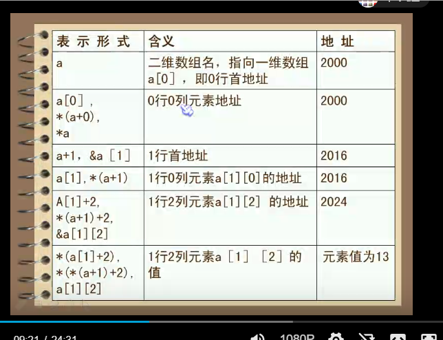

打印二维数组

```c
#include<stdio.h>

void PrintTwoArray(int (*a)[4],int row,int len){//(*a)[4]必须要传递列值,数组指针变量
	int i,j;
	for(i=0;i<row;i++){
		for(j=0;j<len;j++){
			printf("%d ",*(*(a+i)+j));
		}
		printf("\n");
	}
}

int main(){
	int a[3][4]={5,6,7,8,9,3,0,4,5,6,7,3};
	printf("a的地址:%d\n",a);
	printf("a: %d\n",&a);
	printf("a[0]:%d\n",a[0]);
	printf("*(*(a+1)):%d\n",*(*(a+1)));
	printf("*(*(a+1)+2):%d\n",*(*(a+1)+2));
	printf("&a[1][0]:%d\n",&a[1][0]);
	printf("--------------------\n");
	PrintTwoArray(a,3,4);
}
```

copy字符串

```c
#include<stdio.h>


void print_string(char *string){
	printf("----------------string b is------\n");
	for(;*string!='\0';string++){
		printf("%c",*string);
	}
	printf("\n");
}
void copy_string5(char *a,char *b){
	char *p;
	p=b;
	while(*p++=*a++){}
	p=b;
	print_string(p);
}


void copy_string4(char *a,char *b){
	char *p;
	p=b;
	while(*a!='\0'){
		*p++=*a++;
	}
	p=b;
	print_string(p);
}

void copy_string3(char *a,char *b){
	char *p;
	p=b;
	while((*p++=*a++)!='\0'){
	}
	p=b;
	print_string(p);
}
void copy_string2(char *a,char *b){
	char *p;
	p=b;
	while((*p=*a)!='\0'){
		p++;
		a++;
	}
	p=b;
	print_string(p);

}
void copy_string1(char *a,char *b){
	char *p1,*p2;
	p2=b;
	p1=a;
	for(;*p1!='\0';p1++,p2++){
		*p2=*p1;
	}
	*p2='\0';
	p2=b;
	printf("-------------------------\n");
	print_string(p2);
}
int main(){
	char string[]="hello world";
	char *a="i love you",b[]="hello world ",*p1,*p2;//此处应该定义为char b[] 而不能用char  *b;因为char *b放在了常量区,不能被修改.
	char *s="hello ";
	int i;
	printf("%s\n",string);
	printf("%s\n",s);
	
	p1=a;
	p2=b;
	for(;*p1!='\0';p1++,p2++){
		*p2=*p1;
	}
	*p2='\0';
	printf("----------------string b is-------\n");
	for(i=0;b[i]!='\0';i++){
		printf("%c",b[i]);
	}
	printf("---------------------\n");
	copy_string1(a,b);	
	copy_string2(a,b);
	copy_string3(a,b);
	copy_string4(a,b);
	copy_string5(a,b);

}
```

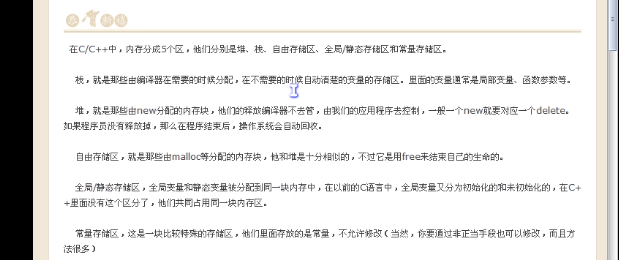

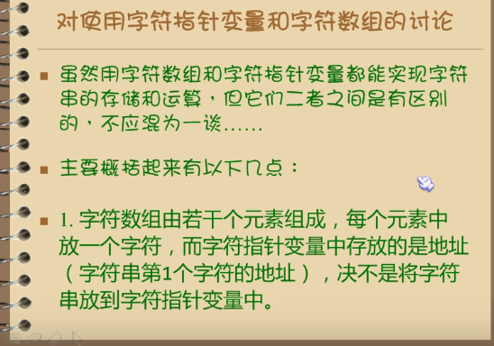

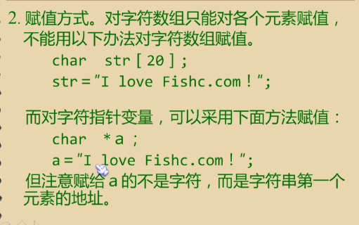

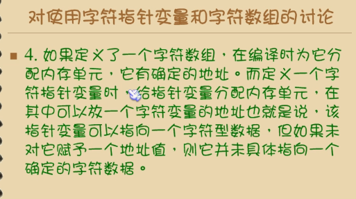

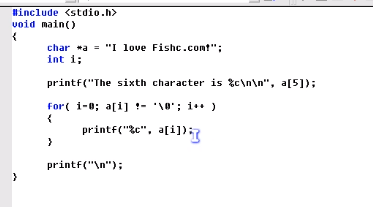

指针函数传递参数

```c
#include<stdio.h>

int add(int x,int y){
	return x+y;
}
int min(int x,int y){
	if(x>y){
		return y;
	}
	return x;
}
int max(int x,int y){
	if(x>y){
		return x;
	}else{
		return y;
	}
}
void prosess(int x,int y,int (*fun)()){///////////////////
	printf("%d\n",fun(x,y));
}
int main(){
	int min(int,int);
	int max(int,int);
	int add(int,int);
	void prosess(int ,int ,int (*fun)());

	int a,b;
	scanf("%d %d",&a,&b);
	printf("max=");
	prosess(a,b,max);
	printf("min=");
	prosess(a,b,min);
	printf("sum=");
	prosess(a,b,add);
}
```

输入序号打印学生各科成绩

```c
#include<stdio.h>
int *search(int (*score)[4],int id){
	return *(score+id);
}
int main(){
	int score[][4]={12,3,34,54,56,25,63,90,12,57,63,27};
	int id,i;
	int *p;
	scanf("%d",&id);
	if(id-1>0&&id-1<3){
		p=search(score,id-1);
		for(i=0;i<4;i++){
			printf("%d ",*(p+i));
		}
		printf("\n");
	}

}

```

判断不及格的学生

```c
#include<stdio.h>
int *search(int (*score)[4],int id){
	return *(score+id);
}

int print_score1(int (*score)[4],int i){
	int j;
		for(j=0;j<4;j++){
			if(*(*(score+i)+j)<60){
				return i+1;
			}
		}
		return -1;
	}

void print_score(int *p){
	int i=0;
	for(;i<4;i++){
		printf("%d ",*(p+i));
	}
	printf("\n");
}

int main(){
	int score[][4]={12,3,34,54,70,89,63,90,12,57,63,27};
	int id,i;
	int *p1;
	scanf("%d",&id);
	if(id-1>=0&&id-1<3){
		p1=search(score,id-1);
		print_score(p1);
	}
	for(i=0;i<3;i++){
		if(print_score1(score,i)>0){
			printf("%d号不及格 ",print_score1(score,i));
		}else{
			printf("及格 ");
		}
	}
}

```

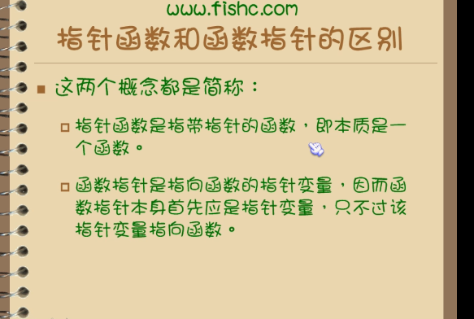

字符串排序

```c
#include<stdio.h>
#include<string.h>
void sort(char *name[],int n){
	int i,j;
	char *p;
	for(i=0;i<n-1;i++){
		for(j=i+1;j<n;j++){
			if(strcmp(name[i],name[j])>0){
				p=name[i];
				name[i]=name[j];
				name[j]=p;
			}
		}
	}
}
void print(char *name[] , int n){
	int i;
	for(i=0;i<n;i++){
		printf("%s ",name[i]);
	}
	printf("\n");
}
int main(){//指针数组
	char *name[]={"php","go","c++","java","c"};

	int n=5;
	sort(name,n);
	print(name,n);
	
}

```

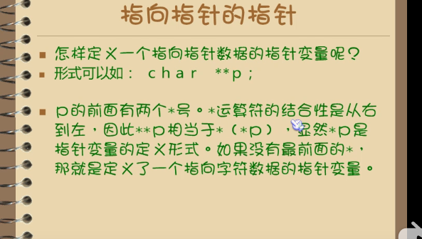

```c
	char *name[]={"php","go","c++","java","c"};
	char **p;
	int i;
	int n=5;
	for(i=0;i<n;i++){
		p=name+i;
		printf("%5s",*p);
	}
```

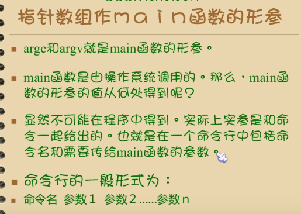

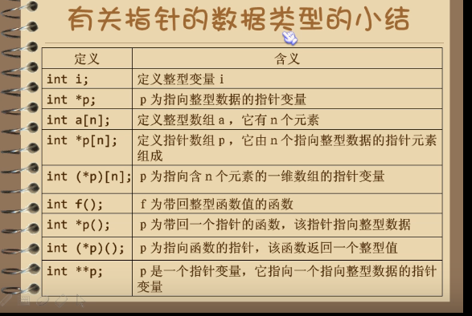

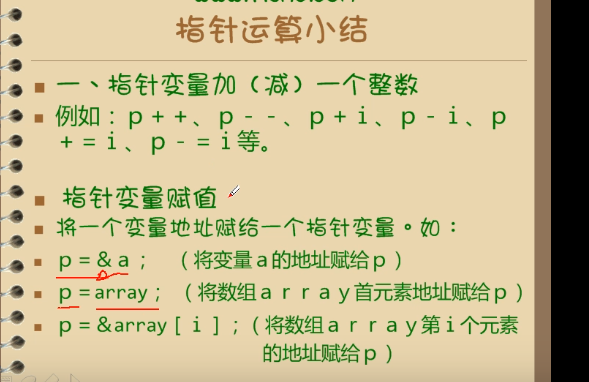

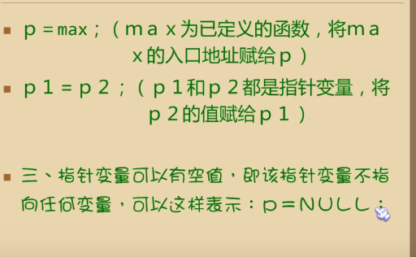

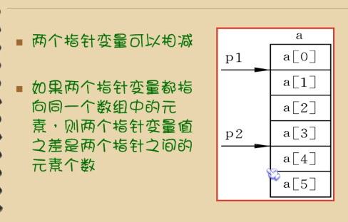

```c
void test(){
	int name[]={1,2,4,53,3};
	int *p1,*p2;
	p1=&name[1];
	p2=&name[4];
	printf("%d",p2-p1);//3
}
```

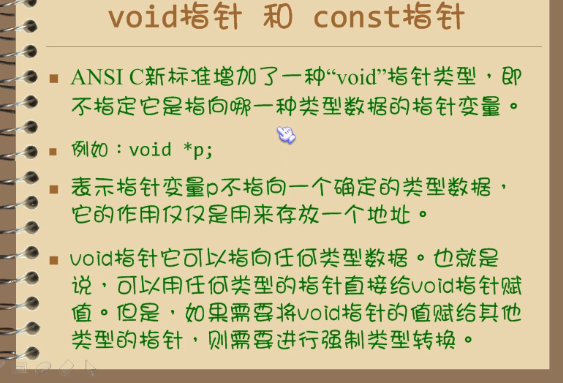

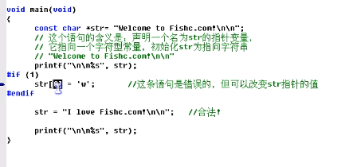

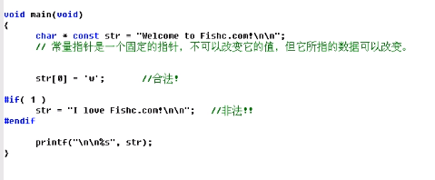

带参数的宏定义

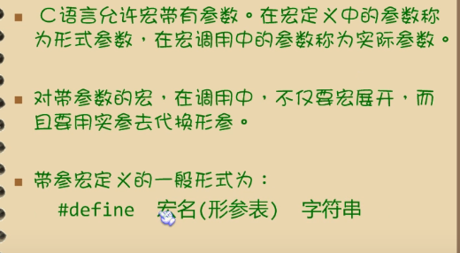

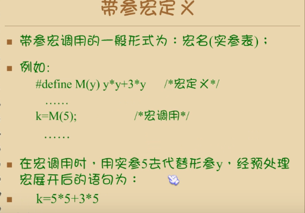

```c
#include<stdio.h>

#define M(a,b) (a>b)?a:b

int main(){
	int a,b;
	scanf("%d %d",&a,&b);
	printf("max=%d",M(a,b));
}
```

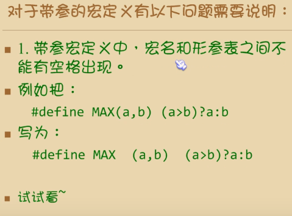

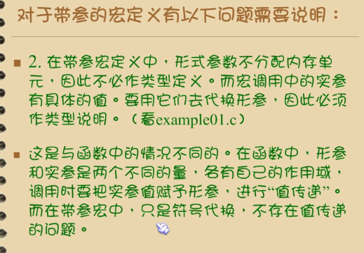

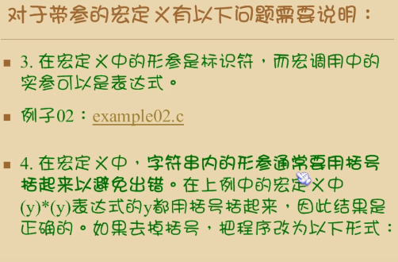

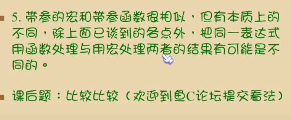

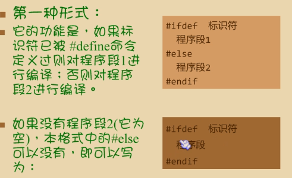


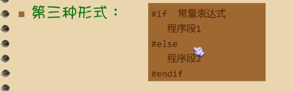

结构体

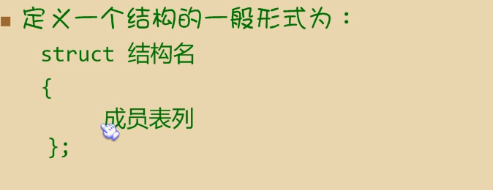

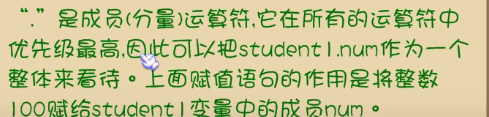

```c
#include<stdio.h>
struct date{
	int year;
	int month;
	int day;
};
struct{
	int id;
	char *name;
	char gender;
	int age;
	float score;
	char *addr;
	struct date birthday;
}student1,student2={1,"hanmeimei",'m',45,22.2f,"hubei",2019,12,12};

int main(){
	student1=student2;
	printf("number=%d\nname=%s\ngender=%c\nage=%d\nscore=%f\naddr=%s\nbirthday=%d-%d-%d\n",student1.id,student1.name,student1.gender,student1.age,student1.score,student1.addr,student1.birthday.year,student1.birthday.month,student1.birthday.day);

}
```

实现投票

```c
#include<stdio.h>
#include<string.h>
struct PushTicket{
		char *name;
		int ticket;
	}*point,ticket[5]={{"hanmeimei",0},{"lilei",0},{"lili",0},{"c",0},{"java",0}};
	
void PrintTicket(struct PushTicket *point){
	int i;
	point=ticket;
	printf("------------候选人的票-----------\n");
	for(i=0;i<5;i++,point++){
		printf("%s-----:%d\n",point->name,point->ticket);
	}
			
}
void compare(char *input){
	int i;
	point=ticket;
	for(i=0;i<5;i++,point++){
		if(strcmp(input,point->name)==0){
			(point->ticket)++;
		}
	}
}
int main(){
	int i;
	char input[20];
	point=ticket;
	printf("------------候选人-----------\n");
	for(i=0;i<5;i++,point++){
		printf("%s ",point->name);
	}
	printf("\n");
	printf("---------------\n");
	while(1){
		printf("请输入候选人名称投票:");
		scanf("%s",&input);
		compare(input);
		if(strcmp(input,"-1")==0){
			break;
		}


	}
			PrintTicket(point);
}

```

动态数组

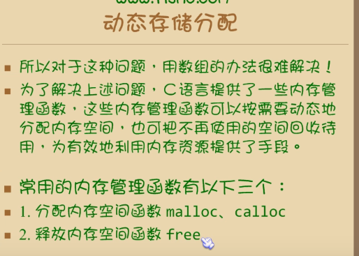

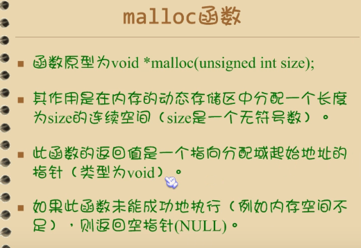

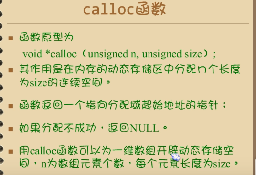

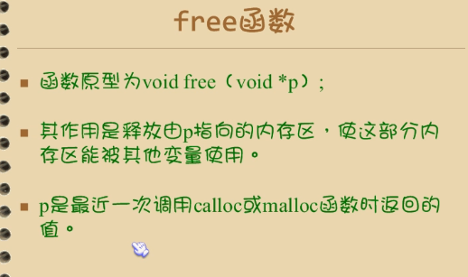

链表

```c
#include<stdio.h>
struct student{
	int num;
	float score;
	struct student *next;
};
void PrintLink(struct student *p){
	while(p!=NULL){
		printf("num=%d,score=%f",p->num,p->score);
		p=p->next;
	}
	
}
int main(){
	struct student a,b,c,*head;
	a.num=1;
	a.score=89.0f;
	a.next=&b;
	b.num=2;
	b.score=90;
	b.next=&c;
	c.num=3;
	c.score=100;
	c.next=NULL;
	head=&a;
	PrintLink(head);
}
```

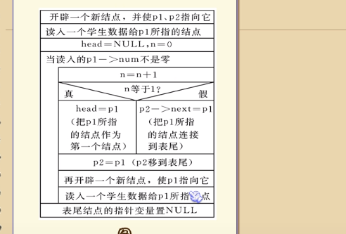

```c
#include<stdio.h>
#include<malloc.h>

#define LEN sizeof(struct student)
struct student{//定义链表
	int num;
	float score;
	struct student *next;
};
void print(struct student *head){//打印链表
	while(head!=NULL){
		printf("num=%d,score=%f\n",head->num,head->score);
		head=head->next;
	}
}
struct student *DeleteNode(int input,struct student *head){
	struct student *p1,*p2;
	if(head==NULL){
		printf("空链表\n");
	}	
	p1=head;	
		while(p1->num!=input&&p1->next!=NULL){//当输入的shu和链表的书不相等时.
			p2=p1;
			p1=p1->next;
		}
		if(p1->num==input){
			if(p1==head){
				head=p1->next;	
			}else{
				p2->next=p1->next;
			}
		}
		return head;
	}
struct student *insert(struct student *stu,struct student *head){//有bug
	struct student *p1,*p2,*p0;
	p0=stu;
	if(head==NULL){
		printf("NUll linktable\n");
	}
	p1=head;
	while(p0->num>p1->num&&(p1->next!=NULL)){
		p2=p1;
		p1=p1->next;
		if(p0->num<=p1->num){
			if(head==p1){
				head=p0;
			}else{
				p2->next=p0;
				p0->next=p1;
			}

		}else{
			p1->next=p0;
			p0->next=NULL;
		}

	}
	p1=head;
	p2=p1;
return head;


}
struct student *create(){//创建链表
	int n=0;
	struct student *head,*p1,*p2;
	p1=p2=(struct student *)malloc(LEN);
	printf("input num-------------:");
	scanf("%d",&p1->num);
	printf("input score-----------:");
	scanf("%f",&p1->score);
	head=NULL;
	while(p1->num!=0){
		n++;
		if(n==1){
			head=p1;
		}else{
			p2->next=p1;
		}
		
	
		p2=p1;
		p1=(struct student *)malloc(LEN);
		printf("input num-------------:");
		scanf("%d",&p1->num);
		printf("input score-----------:");
		scanf("%f",&p1->score);
	}
		p2->next=NULL;

	return head;
	
}
int main(){
	int input;
	struct student *stu,*p,stu1;
	stu=create();
	p=stu;
	print(p);
	printf("\n");
	printf("删除节点-----:");
	scanf("%d",&input);
	print(DeleteNode(input,p));
	printf("\n");
	printf("插入节点");
	printf("input num-------------:");
	scanf("%d",&stu1.num);
	printf("input score-----------:");
	scanf("%f",&stu1.score);
	print(insert(&stu1,stu));
	printf("\n");


printf("插入节点");
	printf("input num-------------:");
	scanf("%d",&stu1.num);
	printf("input score-----------:");
	scanf("%f",&stu1.score);
	print(insert(&stu1,stu));
	printf("\n");

}
```

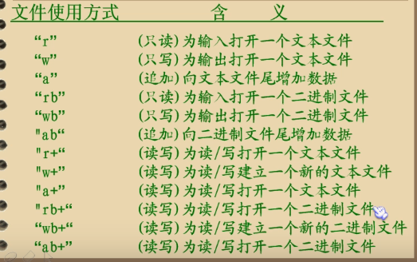

```c
#include<stdio.h>
#include<stdlib.h>

int main(){
	FILE *file;
	if(!(file=fopen("d:\\hello.txt","w"))){
		printf("error");
	}else{
		printf("success!!!\n");
		
	}
}
```

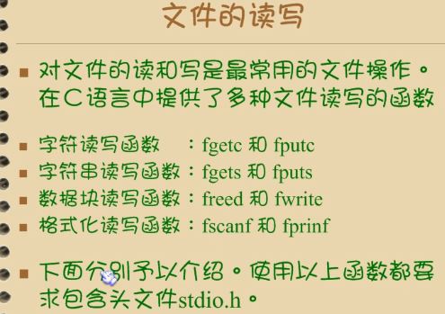

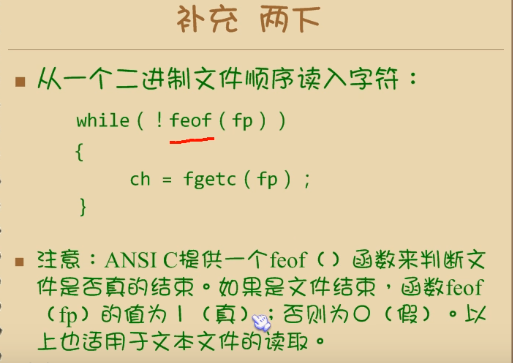

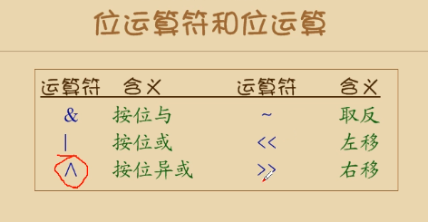

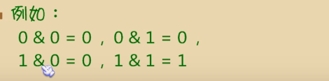

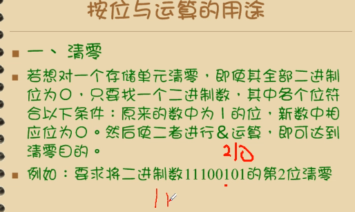

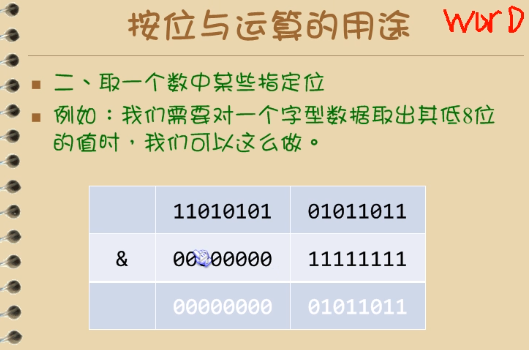

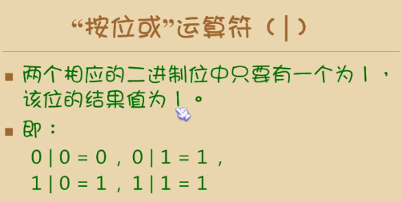

用位运算实现大小写转换

```c
#include<stdio.h>


int main(){
	char ch;
	printf("please input char:");
	ch=getchar();
	while(!(ch>'A'&&ch<'z')||(ch>'Z'&&ch<'a')){
		printf("error please input:\n");
		ch=getchar();
	}
	if(ch & 32){//32的二进制位是100000 ch&100000得到第五位数是0,然后就换转大写
		ch=ch&223;
	}else{
	
		ch=ch|255;//得到第五位数是1 转小写.
	}
	putchar(ch);

	ch=getchar();//打印回车
	putchar(ch);


}
```

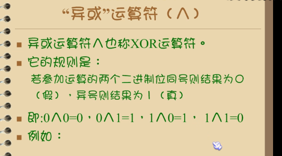

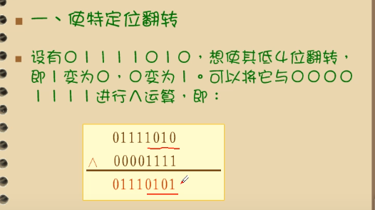

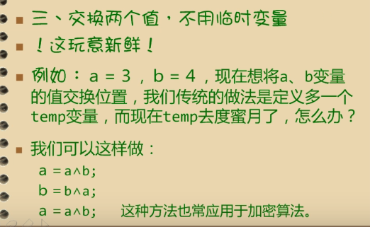

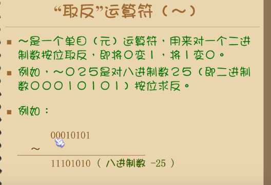

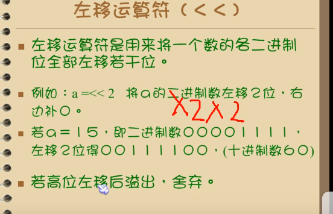

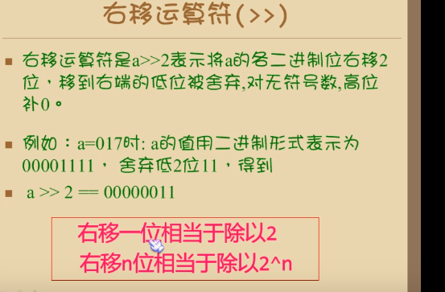

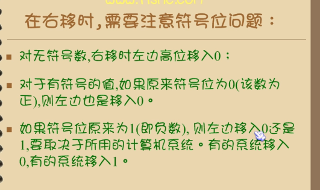

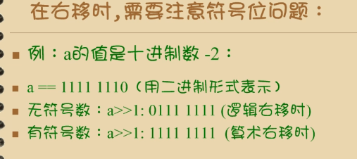

struct与malloc

```c
#include<stdio.h>
#include<malloc.h>
#define LEN sizeof(struct student)
struct student{
	int id;
	char *name;
	int score;
};

void fun(struct student *p){
	(*p).id=12;
	p->name="hello";
	p->score=90;

}
void show(struct student *p){
	printf("%d %s %d\n",p->id,p->name,p->score);
}

int main(){
	struct student *stu;
	stu=(struct student *)malloc(LEN);
	fun(stu);
	//printf("%d %s %d",stu.id,stu.name,stu.score);
	show(stu);
}
```

动态数组的增删排

```c
#include<stdio.h>
#include<malloc.h>
#include<stdlib.h>
struct Arr{
	int *pBase;//数组的首地址
	int len;//数组的长度
	int cnt;//当前有效元素的个数
};


void init_arr(struct Arr *,int length);

int append_arr(struct Arr *,int val);//追加

int insert_arr(struct Arr *,int pos,int val);

int delete_arr(struct Arr *,int pos,int *val);

//int get();

int is_empty(struct Arr *p);

int is_full(struct Arr *p);

int sort_arr(struct Arr *p);

void show_arr(struct Arr *p);

int reverse_arr(struct Arr *p);

int main(){
	struct Arr arr;
	int val;
	init_arr(&arr,6);
	append_arr(&arr,100);
	append_arr(&arr,99);
	append_arr(&arr,80);
	append_arr(&arr,23);
	if(append_arr(&arr,45)){
		printf("append success\n");
	}
	insert_arr(&arr,7,555);
	if(append_arr(&arr,567)){
		printf("append success\n");
	}

	if(append_arr(&arr,1000)==1){
		printf("append success\n");
	}
	printf("%d\n",arr.cnt);
	show_arr(&arr);
	printf("----------删除元素-------\n");
	delete_arr(&arr,3,&val);
	printf("--------删除的元素是:%d\n",val);
	show_arr(&arr);
	printf("----------倒置元素--------\n");
	reverse_arr(&arr);
	show_arr(&arr);
	printf("----------排序-------------\n");
	sort_arr(&arr);
	show_arr(&arr);
	printf("%d\n",arr.cnt);
	

}
void init_arr(struct Arr *p,int length){
	p->pBase=(int *)malloc(sizeof(int)*length);
	if(NULL==p->pBase){
		printf("error\n");
		exit(-1);
	}
	p->len=length;
	p->cnt=0;

	return;
}
int is_empty(struct Arr *p){
	if(p->cnt==0){
		return 1;
	}
	return 0;

}
void show_arr(struct Arr *p){
	int i;
	if(is_empty(p)==1){
		printf("数组为空\n");	
	}
	for(i=0;i<p->cnt;i++){
		printf("%d ",*(p->pBase+i));
	}
	printf("\n");
}

int is_full(struct Arr *p){
	if(p->cnt==p->len){
		return 1;
	}
	return 0;
}
int  append_arr(struct Arr *p,int val){
	if(is_full(p)==1){
		printf("数组已满\n");
		return 0;
	}
	//不满时
	p->pBase[p->cnt]=val;
	(p->cnt)++;
	return 1;
}
int insert_arr(struct Arr *p,int pos,int val){
	int i=(p->cnt)-1;
	if(pos<1||pos>(p->cnt)+1){//<1或者大于当前有效元素
		return 0;
	}
	if(is_full(p)==1){
		printf("数组已满\n");
		return 0;
	}
	//pos的值从1开始,且从pos的位置之前插入
	for(;i>=pos-1;i--){
		p->pBase[i+1]=p->pBase[i];
	}
	p->pBase[pos-1]=val;
	(p->cnt)++;
	return 1;

}
int delete_arr(struct Arr *p,int pos,int *val){
	int i;
	if(is_empty(p)==1){
		printf("数组为空\n");
		return 0;
	}
	if(pos<1||pos>p->cnt){
		return 0;
	}
	*val=p->pBase[pos-1];
	for(i=pos;i<=p->cnt;i++){
		p->pBase[i-1]=p->pBase[i];
	}
	(p->cnt)--;
	return 1;
}
int reverse_arr(struct Arr *p){
	int i=0,temp,j=p->cnt-1;
	//int *low,*high;
	if(is_empty(p)==1){
		printf("数组为空\n");
		return 0;
	}
	while(i<j){
		temp=p->pBase[i];
		p->pBase[i]=p->pBase[j];
		p->pBase[j]=temp;
		i++;
		j--;
	}
	
	/*low=&(p->pBase[0]);
	high=&(p->pBase[p->cnt]);
	for(i=0;i<=(high-low)/4;i++){
		low=&(p->pBase[i]);
		high=&(p->pBase[p->cnt-1-i]);
		temp=*low;
		*low=*high;
		*high=temp;
	}*/
	return 1;

}
int sort_arr(struct Arr *p){
	int i,min,j,temp;
	for(j=0;j<p->cnt;j++){
		min=p->pBase[j];
		for(i=j+1;i<p->cnt;i++){
			if(p->pBase[i]<min){
				temp=p->pBase[i];
				p->pBase[i]=min;
				min=temp;
			}
		}
			p->pBase[j]=min;
	}

	return 1;
}
```

### c++核心编程

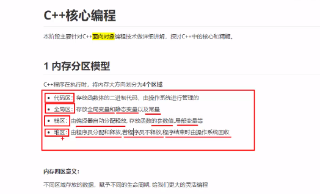

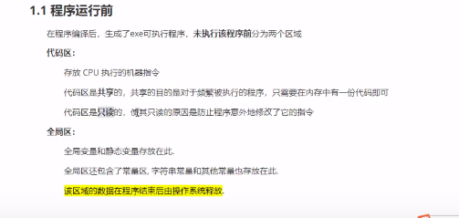

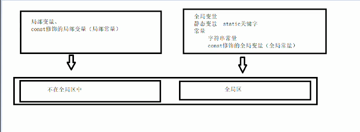


引用是指针常量

如:

```c++
int a=10;

int &b=a;
```

即:

```c++
int *const b=&a;
```


```c++
#include<iostream>

using namespace std;
void test(int ,int =10);//占位参数,且可以有默认参数
void test(int a,int b){
    return a+b;
}
int fun(int a,int b=10000,int c=100){//若我们自己传入数据,就用自己的数据,如果没有,就用默认值 
	return a+b+c;
}
//注意事项,若某个位置有了默认参数,那么从这个位置后的参数都必须要有默认值
//如果函数声明和函数实现只能有一个有默认参数
int main(){
	cout<<fun(10,20)<<endl;
} 
```

**函数重载**

1 必须在同一个作用域下

2 函数名称相同

3 函数参数类型不同,或者个数不同,或者顺序不同

```c++
void fun(){
    cout<<"fun"<<endl;
}
void fun(int){
    cout<<"fun!"<<endl;
}
//返回值不能作为函数重载的条件
//注意事项

//1 引用作为重载的条件
void func(int &a){
    cout<<"引用作为重载"<<endl;
}
void func(const int &a){
    cout<<"const int &a作为重载"<<endl;
}
int a=10;
func(a);//调用的是func(int &a)
func(10);//调用的是func(const int &a)
//2 函数重载作为默认参数
void func2(int a,int b=10){
    cout<<"func2(int a,int b=10)"<<endl;
}
void func2(int a){
    cout<<"func2(int a)"<<endl;
}
//出现歧义
//应该避免这种情况

```

### 类和对象

```c++
//圆类
#include<iostream>

using namespace std;

const double PI=3.14;

class Circle{
	public://权限,访问权限:public protected,private
		int r ;
		double calculateZC(){
			return 2*PI*r;
		}
};

int main(){
	//创建对象
	 Circle c1;
	 c1.r=3;
	 cout<<"圆的周长:"<<c1.calculateZC()<<endl;
	 
} 
//struct和class的区别:
//struct默认权限是public
//class默认权限是private

```

构造函数

1 构造函数没有返回值,不用写void

2 函数名与类名相同

3 构造函数可以有参数,可以发生重载

4 创建对象的时候,构造函数会自动调用,且只调用一次

1 析构函数 进行清理的操作

2 没有返回值,不写void

3 函数名与类名相同,在名称前加~

4 对象在销毁前会自动调用析构函数,且只会调用一次

```c++
#include<iostream>

using namespace std;

class Person{
	
	public:
		Person(int a){
			cout<<"person构造函数的调用"<<endl; 
			cout<<a<<endl;
		}
		~Person(){
			cout<<"析构函数的调用"<<endl; 
		}
};

void test(){
	Person p1(12);//在栈上的数据 
}

int main(){
	test();
} 
```

拷贝构造

```c++
#include<iostream>

using namespace std;

//构造函数的分类和调用

//
class Person{
	public:
		Person(){
			cout<<"无参"<<endl; 
		};//无参构造 
		Person(int a){//有参构造 
			cout<<"有参"<<endl; 
		}
		//拷贝构造函数
		Person(const Person &p){
			//将传入的对象的所有属性拷贝到自己身上.
			cout<<"拷贝构造"<<endl; 
		} 
		~Person(){
			cout<<"析构"<<endl; 
		}
}; 

int main(){
	//括号法
	Person p1;
	Person p2(12); 
	//调用拷贝构造函数
	Person  p3(p1);
	//注意事项:
	//不能用Person p1()调用,编译器会认为一个函数,不会认为是创建对象 
	//显示法
	Person p4=p1; 
	Person(10);//匿名对象 ,当前行执行结束,系统会立即回收掉匿名对象 
	//不要利用拷贝构造函数初始化匿名对象如: Person(p1); 编译器会认为Person (p1)==Person p1 ,对象声明 
	//隐式转换法 
	Person  p5=10;//等价于 Person p5=Person(10); 有参构造 
	Person p6=p5;//拷贝 
} 
```

拷贝构造函数使用时机

```c++
#include<iostream>

using namespace std;

//拷贝构造函数调用时机 
//1 使用一个已经创建的对象来初始化一个新对象 
//2 值传递的方式给函数传值
//3 值返回局部对象
class Person{
	public:
		Person(){
		cout<<"默认"<<endl; 
		};
		Person(const Person &p){
			cout<<"拷贝构造"<<endl; 
		}
		~Person(){
			cout<<"析构"<<endl; 
		}
}; 

void test1(){
	Person p1;
	Person p2(p1);
}
void dowork(Person p){
	
}
void test2(){
	Person p3;
	dowork(p3);
}
Person dowork1(){
	Person p4;
	cout<<"p4--"<<(int*)&p4<<endl;
	return p4;
}
void test3(){
	Person p5=dowork1();
	cout<<(int*)&p5<<endl;
} 
int main(){
	test1();
	test2();
	test3();

	return 0;
} 
/*默认
拷贝构造
析构
析构
默认
拷贝构造
析构
析构
默认
p4--0019FE64
拷贝构造
析构
0019FECC
析构
Press any key to continue
*/
//如果写了有参构造,编译器不提供无参
//写了拷贝构造,不提供其他构造函数
```

深拷贝浅拷贝

浅拷贝:简单的赋值拷贝操作

深拷贝:在堆区重新申请空间,进行拷贝操作

```c++
#include<iostream>

using namespace std;

//深拷贝,浅拷贝
class  Person{
	public:
		Person(){	
		}
		~Person(){
			//将堆区开辟的数据释放
			 if(P_height!=NULL){
			 	delete P_height;
			 	P_height=NULL;
			 } 
		}
		Person(int age,int height){
			P_height=new int(height);
			P_age=age;
		}
		Person(const Person &p){
			P_age=p.P_age;
			//p_height=p.P_height;编译器执行的是这种
			//用深拷贝解决
			 P_height=new int(*p.P_height); 
		}
		
		int P_age;
		int *P_height;
};

void Test1(){
	Person p(12,150);
	Person p1(p);
	cout<<p.P_age<<*p.P_height<<endl;
	cout<<p1.P_age<<*p1.P_height<<endl;
}
int main(){
	Test1();
	return 0;
} 
```

初始化列表

```c++
#include<iostream>

using  namespace std;
class Person{
	public:
		Person(int a,int b,int c):a(a),b(b),c(c){//初始化列表 
		}
		int a;
		int b;
		int c;
};	
int main(){
	Person p(1,2,3);
	cout<<p.a<<p.b<<" "<<p.c<<endl;
	
}
```

对象成员

```c++
#include<iostream>
#include<string>
using namespace std;

class Phone{
	public:
		Phone(string Phone_name):name(Phone_name){ 
			cout<<"Phone的构造"; 
		}
		string name;
};
class Person{
	public:
		Person(string name,int id):phone(name),P_id(id){
			cout<<"Person的构造"; 
		}
		Phone phone;
		int P_id;
};

void test(){
	Person p("apple",12);
	cout<<p.phone.name<<endl;
}
int main(){
	test();

	return 0;
} 
//Phone的构造 Person的构造 apple
//先初始化Phone再初始化Person
```

static成员

静态成员函数:所有对象共享,只能访问静态变量

静态成员变量:所有对象共有,类内声明,类外定义

```c++
#include<iostream>

using namespace std;

class Person{
	public:
		static void fun(){
			cout<<"静态成员函数"<<endl; 
			cout<<a++<<endl;
		}
		static int a; 
		
};
int Person::a=0;
int main(){
	//对象访问
	Person p;
	p.fun(); 
	Person::fun();//类访问 
} 
```

只有非静态成员变量属于对象

空对象的内存占用为1个字节

this指针: this指针指向被调用的成员函数所属的对象,this指针是指针常量其指向不可以修改

1 可以解决名称冲突

2 返回此对象 return *this;

```c++
#include<iostream>

using namespace std;

class Person{
	public:
		int age;
		Person(int age):age(age){
		}
		Person& addPersonAge(Person &p){
			this->age+=p.age;
			return *this;
		}
		
}; 

int main(){
	Person p1(10);
	Person p2(10);
	p2.addPersonAge(p1).addPersonAge(p1).addPersonAge(p1);
	cout<<p1.age<<endl;
	cout<<p2.age<<endl;
	
} 
```

常函数 :不能修改指针指向和值.

常对象:只能调用常函数


友元函数

```c++
#include<iostream>
using namespace std;

class Building{
	friend void visit(Building &b);//友元函数//友元类 firend class GoodGay;
	public:
		string sittingRoom;
		Building(){
			sittingRoom="客厅";
			bedRoom="卧室"; 
		}
	private:
		string bedRoom; 
};

void visit(Building &b){
	cout<<b.sittingRoom<<endl;
	cout<<b.bedRoom<<endl;
} 

int main(){
	Building b;
	visit(b);
}

```

```c++
#include<iostream>
using namespace std;

class Building{
	friend class GoodGay;
	public:
		string sittingRoom;
		Building(); 
	private:
		string bedRoom; 
};
Building::Building(){
	sittingRoom="客厅";
	bedRoom="卧室"; 
}

class GoodGay{
	public:
		GoodGay();
		void visit();
		Building *building; 
}; 
GoodGay::GoodGay(){
	building=new Building;
} 
void GoodGay::visit(){
	cout<<building->sittingRoom<<endl;
	cout<<building->bedRoom<<endl;
}


int main(){
	GoodGay gay;
	gay.visit();
}
```

成员函数做友元

```c++
#include<iostream>
//此处若要将哪个类的成员函数做右元,其类应放在前面,此乃大坑
using namespace std;
class Building;
class GoodGay{
	public:
		GoodGay();
		Building *building;
		void visit();
};
class Building{
	friend void GoodGay::visit();//将GoodGay类的visit作为BUilding的友元,GoodGay应该先定义.注意与友元类的区别
	public:
		Building();
		string sitRoom;
	private:
		string bedRoom;
	
}; 
Building::Building(){
	sitRoom="客厅";
	bedRoom="卧室"; 
}
GoodGay::GoodGay(){
	building=new Building;
} 
void GoodGay::visit(){
	cout<<building->sitRoom<<endl;
	cout<<building->bedRoom<<endl; 
}
int main(){
	GoodGay gay;
	gay.visit();
} 
```

运算符重载

```c++
#include<iostream>

using namespace std;


//加号运算符重载
//全局函数重载加号
 
class Person{
	public:
		int a;
		int b;
//		Person operator+(Person &p){//成员函数的本质 
//			Person temp;
//			temp.a=p.a+this->a;
//			temp.b=p.b+this->b;
//			return temp;	
//		}	
};

Person operator+(Person &p1,Person &p2){
	Person temp;
	temp.a=p1.a+p2.a;
	temp.b=p1.b+p2.b;
	return temp;
} 
int main(){
	Person p1;
	Person p2;
	p2.a=12;
	p2.b=23;
	p1.a=10;
	p1.b=10;
	Person p3=p1+p2;
	cout<<p3.a<<"------------"<<p3.b<<endl;
} 
```

左移运算符重载

```c++
#include<iostream>


using namespace std;


class Person{
	friend ostream & operator<<(ostream &cout,Person &p);
	private:
		int a;
		int b;
	public:
		Person(int a,int b){
			this->a=a;
			this->b=b;
		}
};

ostream & operator<<(ostream &cout,Person &p){
	cout<<p.a<<"-----------"<<p.b;
}

int main(){
	Person p1(12,23);
	cout<<p1<<endl;//直接输出对象
	
}
```

递增运算符重载

```c++
#include<iostream>


using namespace std;

//自增运算符重载 

class MyInteger{
	friend ostream & operator<<(ostream &cout,MyInteger Integer);//为什么不传引用 
	private:
		int num;
		
	public:
		MyInteger(){
			num=0;
		}
	MyInteger& operator++(){//前置++
		num++;
	return *this;
	}
	
	MyInteger operator++(int){//后置++
		MyInteger temp=*this;
		num++;
		return temp;
	}
	 	
}; 
ostream & operator<<(ostream &cout,MyInteger Integer){
	cout<<Integer.num;
	return cout;
}
//重载++运算符
 //前置++,后置++;
 
 void test(){
 	MyInteger myint;
	cout<<myint++<<endl;
	cout<<myint<<endl;
 	
 }
int main(){
	MyInteger num;
	cout<<num<<endl;
	cout<<++num<<endl; 
	cout<<num<<endl;
	test();
} 
```

赋值运算符重载

```c++
#include<iostream>

using namespace std;

class Person{
	public:
		int *a;
	public:
		Person(int age){
			a=new int(age);
		}
		~Person(){
			if(a!=NULL){
				delete(a);
				a=NULL;
			}
		}
		Person & operator=(Person &p){
			if(a!=NULL){
				delete(a);
			} 
			a=new int(*p.a);//深拷贝 
			return *this; 
		} 
};

void test(){
	Person p1(20);
	Person p2(10);
	Person p3(10);
	p3=p2=p1;
	cout<< *p2.a<<endl;
	cout<< *p3.a<<endl;
}

int main(){
	test();
} 
```

关系运算符重载

```c++
#include<iostream>

using namespace std;

class Person{
	private:
		int age;
		string name;
	public:
		Person(int age,string name){
			this->age=age;
			this->name=name;
		}
		bool operator==(Person &p){
			if(this->age==p.age&&this->name==p.name){
				return true;
			}
			return false;
		}
};

int main(){
	Person p1(12,"java");
	Person p2(12,"java");
	if(p1==p2){
		cout<<"p1=p2"<<endl;
	}else{
		cout<<"p1!=p2"<<endl;
	}
} 
```

仿函数

```c++
#include<iostream>
using namespace std;

class Person{
	public:
		void operator()(string text){
			cout<<text<<endl;
		}
};
int main(){
	Person p1;
	p1("Hello world");
    Person()("123");//匿名对象 
}
```

### 继承

继承的构造和析构的循序:先父类再子类,然后子类析构父类析构

访问同名的成员变量需要加作用域其为:

```c++
#include<iostream>

using namespace std;

class Base{
	public:
		int a;
		Base(){
			a=100;
		}
		void fun(){
			cout<<"父类同名函数"<<endl; 
		}
		void fun(int a){
			cout<<"父类同名函数"<<endl; 
		}
	protected:
		int b;
	private:
		int c;
}; 
class A:public Base{
	public:
		A(){
			a=23;
		}
		int a;
		void fun(){
			cout<<"子类同名函数"<<endl; 
		}
};
class B:protected Base{
}; 
class C:private Base{
};
void test(){
	A a1;
	cout<<a1.a<<endl;
	cout<<a1.Base::a<<endl;
	a1.fun();
	a1.Base::fun();
	//若想访问到父类的同名成员函数加作用域 
	a1.Base::fun(1000); 
    //访问静态成员
    //子类::父类::静态变量;表示通过类名访问父类作用域下的静态变量
}
int main(){
	test();
} 
```

多继承

子类:继承方式 父类,继承方式 父类...

菱形继承问题


```c++
#include<iostream>

using namespace std;

class Base{
	public:
		int age;
};
class A:virtual public Base{
};
class B:virtual public Base{
};
class C:public A,public B{
};
void test(){
	C c;
	c.age=100;
	c.age=23;
	cout<<c.age<<endl;
}
int main(){
	test();
} 
```

### 多态

多态的条件: 1 继承 2 子类覆写父类的方法 

使用 父类的引用指向子类的对象

```c++
#include<iostream>

using namespace std;

class Annimal{
	public:
		virtual void speak(){ //虚函数实现多态
			cout<<"动物在说话"<<endl;
	} 
};
class Cat:public Annimal{
	void speak(){
		cout<<"小猫在说话"<<endl; 
	}
}; 
class Dog:public Annimal{
	void speak(){
		cout<<"小狗在说话"<<endl; 
	}
}; 

void doSpeak(Annimal &annimal){
	annimal.speak();
} 
void test(){
	Cat cat;
	doSpeak(cat);
	
}
int main(){
	test();
} 
```

纯虚函数和抽象类

```c++
virtual void speak()=0;有了纯虚函数我们城为抽象类,无法实例化对象
子类必须重写父类的方法;
```

```c++
#include<iostream>

using namespace std;

class AbstractDrinking{
	public:
		//煮水 
		virtual void Boil()=0;
		//冲泡
		virtual void Brew()=0;
		//倒入杯中
		virtual void PourInCup()=0;
		//加料 
		virtual void PutSomething()=0;
		void makeDrink(){
			Boil();
			Brew();
			PourInCup();
			PutSomething();
		}
};
class Coffee:public AbstractDrinking{
	public:
		//煮水 
		virtual void Boil(){
			cout<<"煮水"<<endl; 
		}
		//冲泡
		virtual void Brew(){
			cout<<"冲泡"<<endl; 
		}
		//倒入杯中
		virtual void PourInCup(){
			cout<<"导入杯中"<<endl; 
		}
		//加料 
		virtual void PutSomething(){
			cout<<"加料"<<endl; 
		}
}; 
class Tea:public AbstractDrinking{
	public:
		//煮水 
		virtual void Boil(){
			cout<<"煮水"<<endl; 
		}
		//冲泡
		virtual void Brew(){
			cout<<"冲泡茶叶"<<endl; 
		}
		//倒入杯中
		virtual void PourInCup(){
			cout<<"导入杯中"<<endl; 
		}
		//加料 
		virtual void PutSomething(){
			cout<<"加料"<<endl; 
		}
}; 


void doWork(AbstractDrinking *abs){
	abs->makeDrink();
	delete abs; 
}
void test(){
	doWork(new Coffee);
	doWork(new Tea);
	
}
int main(){
	test();
} 
```

纯虚析构需要声明也需要实现


```c++
#include<iostream>


using namespace std;

class Cpu{
	public: 
		virtual void caculate()=0;
};
class VideoCard{
	public:
		virtual void display()=0;
};
class Memory{
	public: 
		virtual void storage()=0; 
}; 

class Computer{
	public:
		Computer(Cpu *cpu,VideoCard *videoCard,Memory *memory){
			this->cpu=cpu;
			this->videoCard=videoCard;
			this->memory=memory;
	}
	void Work(){
		cpu->caculate();
		videoCard->display();
		memory->storage();
	}
	~Computer(){
		if(cpu!=NULL){
			delete cpu;
		}
		if(videoCard!=NULL){
			delete videoCard;
		}
		if(memory!=NULL){
			delete memory;
		}
	}
	private:
		Cpu *cpu;
		VideoCard *videoCard;
		Memory *memory;
	
};
class IntelCpu:public Cpu{
	public: 
		virtual void caculate(){
			cout<<"Intel的cpu"<<endl;
		}
};
class IntelVideoCard:public VideoCard{
	public:
		virtual void display(){
			cout<<"Intel的显示器"<<endl; 
		}
};
class IntelMemory:public Memory{
	public: 
		virtual void storage(){
			cout<<"Intel的内存"<<endl; 
		}
};
class LenovoCpu:public Cpu{
	public: 
		virtual void caculate(){
			cout<<"Lenovo的cpu"<<endl;
		}
};
class LenovoVideoCard:public VideoCard{
	public:
		virtual void display(){
			cout<<"Lenovo的显示器"<<endl; 
		}
};
class LenovoMemory:public Memory{
	public: 
		virtual void storage(){
			cout<<"Lenovo的内存"<<endl; 
		}
};
void test(){
	Computer *com=new Computer(new IntelCpu,new LenovoVideoCard,new IntelMemory);
	com->Work();
	delete com; 
} 
int main(){
	test();
} 
```

文件操作


```c++
#include<iostream>
#include<fstream>

using namespace std;

void write(){
	ofstream ofs;
	ofs.open("test.txt",ios::app);
	ofs<<"张三"<<endl;
	ofs<<"李四"<<endl;
	ofs.close();
} 
void read(){
	ifstream ifs;
	ifs.open("test.txt",ios::in);
	if(!ifs.is_open()){
		cout<<"文件打开失败"<<endl; 
	}
	//四种方式读取
	//1
	char buf[1024]={0};
	while(ifs>>buf){
		cout<<buf<<endl;
	} 
	//2
	char buf2[1024]={0};
	while(ifs.getline(buf2,sizeof(buf2))){
		cout<<buf2<<endl;
	}
	//3
	string buffer;
	while(getline(ifs,buffer)){
		cout<<buffer;
	}
	//4单个读取
	 char c;
	 while(c=ifs.get()!=EOF){
	 	cout<<c<<endl;
	 } 
	ifs.close();
}
int main(){
	write();
	read();
}
```

模板必须推导出数据类型才可以使用

```c++
#include<iostream>

using namespace std;


template<class T>
void add(T a,T b){
	cout<<a+b<<endl; 
}

void test(){
	add<int>(23,12);//显示
	add(12.2,34.2);//自动类型推导
}
int main(){
	test();
} 
```

普通函数与函数模板的区别

```c++
#include<iostream>

using namespace std;

int myadd01(int a,int b){
	return a+b;
}
template<class T>
T myadd(T a,T b){
	return a+b;
}
void test(){
	int a=12,b=23;
	char c='a';
	cout<<myadd01(a,b)<<endl;
	cout<<myadd01(a,c)<<endl;
	cout<<myadd(a,b)<<endl;//函数模板自动类型推导,不会发生自动类型转换 
	cout<<myadd<int>(a,c)<<endl;//不能类型转换,需要指定类型 
}
int main(){
	test();
} 
```


```c++
//通过空模板参数调用函数模板
//函数模板也能发生函数重载
#include<iostream>

using namespace std;

template<class T>
void add(T a,T b){
	cout<<"函数模板1"<<endl; 
}
template<class T>
void add(T a,T b,T c){
	cout<<"函数模板2"<<endl; 
}
void add(int a,int b){
	cout<<"普通函数"<<endl; 
}

void test(){
	add(12,30);
	add<>(12,30);
	add(12,30,23);
}
int main(){
	test();
} 
```

函数模板的类对象的对比

```c++
#include<iostream>

using namespace std;

class Person{
	public:
		Person(int age,string name){
			this->age=age;
			this->name=name;
		}
		int age;
		string name;
};
template<class T>
bool mycompare(T &a,T &b){
	if(a==b){
		return true;
	}
}
template<> bool mycompare(Person &a,Person &b){
	if(a.age==b.age&&a.name==b.name){
		return true;
	}
}
void test(){
	Person p1(12,"java");
	Person p2(12,"java");
	cout<<mycompare(p1,p2)<<endl;
}
int main(){
	test();
} 
```

类模板

语法

```c++
template<class T>
类
```

类模板与函数模板的区别


类模板中成员函数的创建时机是模板调用时才创建

类模板的对象作为函数参数

```c++
#include<iostream>
#include<typeinfo>
using namespace std;


template<class T1,class T2>
class Person{
	public:
		Person(T1 name,T2 age){
			this->name=name;
			this->age=age;
		}
		T1 name;
		T2 age;
		void showPerson(){
			cout<<this->name<<" "<<this->age<<endl;
		}
};
//1 指定传入类型 
void printPerson(Person<string,int> &p){//1 指定传入类型 
	p.showPerson();
}
//2 参数模板化
template<class T1,class T2> 
void printPerson2(Person<T1,T2> &p){//1 指定传入类型 
	p.showPerson();
}
//3 整个类模板化
template<class T>
void  printPerson3(T &p){
	p.showPerson();
	cout<<typeid(T).name()<<endl;
}
void test(){//类模板的对象做函数的参数 
	Person<string,int> p1("java",12);
	printPerson(p1);
	printPerson2(p1);
	printPerson3(p1);
}
int main(){
	test();	
} 
```

类模板与继承


类模板成员函数类外实现

```c++
#include<iostream>

using namespace std;

template<class T1,class T2>
class Person{
	public:
		Person(T1 name,T2 age);
		T1 name;
		T2 age;
		void showPerson();
};
template<class T1,class T2>
Person<T1,T2>::Person(T1 name,T2 age){//类模板构造函数类外实现 
	this->name=name;
	this->age=age;
}
template<class T1,class T2>
void Person<T1,T2>::showPerson(){//模板类成员函数类外实现 
	cout<<this->name<<this->age<<endl;
}
void test(){
	Person<string,int> p1("c++",12);
	p1.showPerson();
	
}
int main(){
	test();
}
```

类模板的的分文件编写

```
//将类模板和实现放在同一个文件中并命名为.hpp的文件,然后再.cpp中包含.hpp文件.

```


```c++
#include<iostream>

using namespace std;
#include"person.hpp"
void test(){
	Person<string,int> p1("java",12);
	p1.showPerson();
}
int main(){
	test();
}
```

全局函数类外实现

```c++
#include<iostream>

using namespace std;

template<class T1,class T2>//声明模板 
class Person; //声明类 
	
template<class T1,class T2>//声明这个函数 
void showPerson1(Person<T1,T2> p){
	cout<<p.name<<p.age<<endl;
}


template<class T1,class T2>
class Person{
	friend void showPerson(Person<T1,T2> p){//全局函数类内实现
		cout<<p.name<<p.age<<endl;
	}
	//加空参数列表 
	friend void showPerson1<>(Person<T1,T2> p);
	private:
		T1 name;
		T2 age;
	public:
		Person(T1 name,T2 age){
			this->name=name;
			this->age=age;
		}
		
	
};
void test(){
	Person<string,int> p1("c++",12);
	showPerson(p1);
	showPerson1(p1);
}

int main(){
	test();
}
```

### vector容器

vector存放自定义类型数据

```c++
#include<iostream>
#include<vector>
#include<algorithm>
using namespace std;
class Person{
	friend void test();
	private:
		int age;
		string name;
	public:
			Person(int age,string name){
				this->age=age;
				this->name=name;	
			} 
};
void test(){
	Person p1(12,"java");
	Person p2(13,"c++");
	Person p3(1,"c");
	vector<Person*> v;
	v.push_back(&p1);
	v.push_back(&p2);
	v.push_back(&p3);
	for(vector<Person*>::iterator it=v.begin();it!=v.end();it++){
		cout<<(*it)->age<<(*it)->name<<endl;
	}
}
int main(){
	test();
}
```

string容器


string赋值


string拼接


