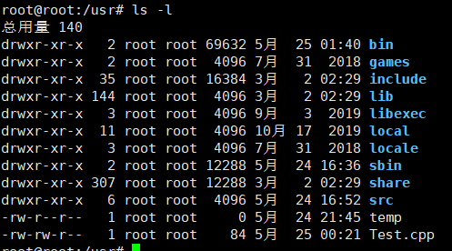
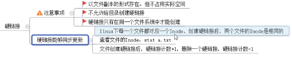

# linux

day1

1. tree 查看目录结构，需要安装 sudo apt-get install tree(ubuntu)

2. ls 查看指定目录下所有文件和目录信息 参数 -a 显示隐藏文件 -l 显示详细信息。

3. cd 非指令，在/bin目录下不能找到。

4. 文件详细9个部分：

   <!--more-->
   
   

第一个字母表示文件类型，d：目录，-：普通目录，s：socket文件，p：管道，c：字符设备，l：链接目录 ，b:块设备。后面每三个字母表示文件所有者即：u，同组用户：g，其他人：o。w表示写权限数字2表示，r读权限数字4，x执行权限1.777表示所有者同组用户，其他人都有读写执行权限。后面的数字表示，文件节点，当文件节点为0，表示这块内存可以存放其他文件。

增加权限：

```
chmod u/g/o/a+/-/=rwx 文件名 权限的改变
chown 改变文件所属组和文件所有者 如 chown alex:root Test.cpp
chgrp 改变组
```

which 查看命令所在目录```which cp```

sudo apt-get  clean 清理文件安装包，所在目录```/var/cache/apt/archives/``` 

创建/删除目录  mkdir 目录名 创建多级 mkdir -r 目录名 如：```mkdir -r /aa/bb/cc```删除目录  rmdir  只能删除空目录或rm -r 递归删除目录以及下的文件。删除文件 rm file  参数 -i用于提示是否删除。

创建文件  touch  文件名。 

复制文件  cp file.txt file1.txt 将file的内容复制到file1 文件不存在则创建，文件存在覆盖，cp 复制目录 cp -r  dir1 dir2 递归复制，如果存在会放在dir2中。

查看文件 cat，more，less，head，tail如：```tail -5 Test.cpp```

创建链接 软链接（快捷方式）文件路径是绝对路径 ，需要参数-s 如：```ln -s /home/a.txt a.test```



查找文件 find ，grep 语法： ```find+路径+-type/-size/-name 类型/大小/名称```，如```find / -name hello;find /usr/ -name "Test.cpp";find /usr/ -size -10k ;find /usr/bin/ -size +10M -size -15M;find /usr/ -type p```

grep 参数-r递归查找 语法：```grep -r "查找的关键字"+路径```

u盘的挂载卸载：自动挂载在/media下面。手动挂载在/mnt下。```fdisk -l```查看磁盘 。```sudo mount /dev/sdb3 /mnt/```手动挂载。

卸载：不能在使用U盘的目录中卸载```umount /mnt```

压缩工具：gzip，bzip2 语法：```gzip 文件名```。```bzip2 文件名```，bzip的参数-k可以保留文件。解压 ```gunzip *.gz```,不能保留文件。解压：```bunzip2 *.bz2``` 。两个都不能压缩目录。

tar 参数：c 创建，x释放（解压），v 查看，f 文件名，z使用gzip的方式生成.gz。j使用bzip生成.bz2。

压缩：```tar czvf 文件名.tar.gz+文件或目录；tar cjvf 文件名.tar.bz2+文件或目录```。解压缩: ```tar zxvf  .gz的压缩包  -C（到指定目录）+路径;tar jxvf  .bz2的压缩包  -C（到指定目录）+路径;```

rar压缩：需要安装sudo apt-get install rar. ```rar a 压缩包名（不同后缀）+文件名或目录;rar x 压缩包+路径；```

zip压缩：```zip 压缩包名（不要后缀）+文件名或目录(目录需要-r)；解压：unzip 压缩包名 -d(到指定目录) +路径;```

进程：ps 参数a（列出当前所有用户的信息）u显示丰富，x查看没有终端的应用程序 ```ps aux```

使用管道管理进程：```ps aux | grep bash ;kill -l;kill -9 进程ID```

查看当前的环境变量 env 并显示PATH ```env | grep PATH``` top显示进程滚动 ```top```

网络管理：```ifconfig``` 通讯 ping 如：```ping 192.168.0.106 -c 4```-c表示回馈4条信息就cut。-i表示多少秒通信一次。

查看IP： nslookup 如：```nslookup www.baidu.com```

用户管理：创建用户： ```sudo adduser +用户名```,还可以使用```sudo useradd -s /bin/bash -g Robin -d /home/Robin -m Robin```会提示Robin组不存在。创建Robin组：```sudo groupadd Robin```,指定密码：```sudo passwd Robin```删除用户：```sudo deluser 用户名```未删除/home/用户名 的内容，需要自己删除。2 ```sudo userdel -r 用户名```删除比较完全，推荐。查看所有用户：```vim /etc/passwd```

ftp服务器：安装vsftpd 。```sudo apt-get install vsftpd;修改配置文件；vim /etc/vsftpd.conf ；listen=YES，anonymous_enable=YES，write_enable=YES，local_umask=022，anon_upload_enable=YES，anon_mkdir_write_enable=YES，重启服务： sudo service vsftpd restart,服务器配置完成```客户端的登录上传和下载：使用```ftp ip地址（ftp的服务器地址）```,上传(只能上传登录ftp服务器前的目录下的文件):put file;下载：get file。匿名用户登录：1 修改配置文件 增加 ```anon_root=路径；重启服务。客户端登陆：ftp ip；name：anonymous;passwd:空；登录```匿名登录只会在anon_root的目录下切换。

lftp客户端：登录：```lftp IP地址;login；可以切换本地目录lcd，上传多个文件mput；下载目录：mirror 目录；上传目录mirror -R 多个目录及其子目录```

nfs服务器（用于共享文件夹）：安装： ```sudo apt-get install nfs-kernel-server;修改配置文件：vim /etc/exports;增加共享目录：/usr/nfsshare/ *(网段)（rw（可读可写）ro（read only）,ayns（同步到磁盘））；重启服务；客户端登陆挂载：mount ip：共享文件夹路径 /mnt；```取消挂载：```sudo umount /mnt```

ssh服务器：```sudo apt-get install openssh-server;登陆：ssh 用户名称@ip```

scp超级拷贝：```scp -r 目标用户名@目标ip：目标目录路径 /保存到本机的绝对路径```

