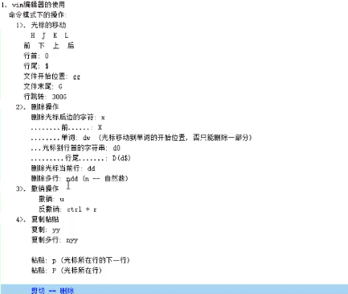
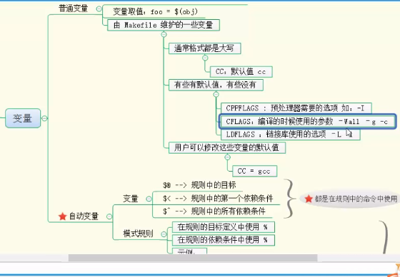
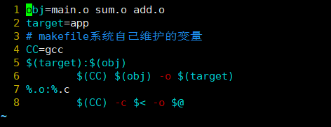
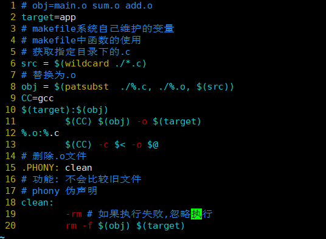
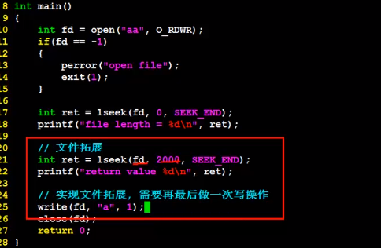

# linux

```man man```用于查看linux文档，第1章shell命令，第二章库函数，等

```alias ls```查看ls命令是否被封装

```echo```输出如：```echo $PATH```输出path变量的值

vim编辑器：命令模式，编辑模式，末行模式；




查找```/字符;?字符;#;```/从光标向下查找，？从光标向上查找，#标注这个单词。遍历的快捷键```n/N```

缩进：向右>>；向左<<。


gcc编译器：

​		将文件编译为可执行程序：```gcc -E Test.c -o Test.i;gcc -S Test.i -o Test.s;gcc -c Test.s -o Test.o;gcc Test.o -o app;./app```也可以直接链接生成可执行程序：```gcc test.c -o app```


包含头文件：-I  头文件的路径如：```gcc sum.c -I /include -o app```-D 定义宏；-g gdb调试；-Wail 警告信息

静态库：

​		命名：lib+名称+.a 制作步骤：生成.o文件，将.o文件打包。打包用```ar rcs 静态库的名字+*.o```；用户执行：```gcc main.c /lib/libtest.a -o app -Iinclude```(头文件)第二种：```gcc main.c -L ./lib(库所在的目录) -l test(库的名字，去掉头lib和后缀.a) -o app -Iinclude```

```nm +可执行程序```查看可执行程序。

共享库：

​		lib+名字+.so;生成与位置无关的代码如：```gcc -fPIC -c *.c -I +头文件```;打包：```gcc -shared  -o lib+名字.so *.o -I +头文件```;将so文件和include打包给用户。用户执行：```gcc main.c(测试) /lib/libtest.so(打包共享库) -o app -Iinclude(头文件)```

用户执行会产生：error while loading shared libraries: libtest.so: cannot open shared object file: No such file or directory；设置环境变量：1 将共享库的目录导入LD_LIBARY_PATH;如：```export LD_LIBARY_PATH=./lib```是暂时的，关闭终端就会失效2 永久设置：修改配置文件/etc/ld.so.conf 将动态库的目录添加进去(绝对路径)。更新：```sudo ldconfig -v ```

ldd 查看可执行程序在执行的所依赖的所有库。

gdb调试：

​		开始运行（r,start）,l 查看代码 l+行号或文件名 设置断点（b +行号或函数名）或者b filename：行号(函数名)n单步，s（stap）单步可以进入函数内部，c直接停在断点。设置条件断点：b +行号 if value=10；删除断点; d+断点编号（info b获取）；从函数体内部跳出：finish，退出当前循环：u；查看变量的值：p；查看变量的类型：ptype+变量名称；设置变量的值：set var+变量名=赋值；设置追踪变量：dispaly；取消追踪变量：undisplay +编号（info display); 退出gdb：quit。

mkfile的编写：

​		创建makefile，格式：目标：依赖文件

​											   		(前必须有tab空格)命令

​		执行```make```,makefile中的变量：







c系统函数:

1.文件描述符: int 类型,

2.pcd: 进程控制块.其中有文件描述符(数组(1024)).

3.虚拟地址空间: 用户区(0-3G)分布(代码段,未初始化的全局变量,已初始化的全局变量,堆,共享库,栈,环境变量,内核区),内核区(3G-4G)(不允许用户操作)

open函数: ```open(文件描述符,什么方式(Q_RDWR));open(文件描述符,什么方式并且创建(Q_RDWR | Q_CREAT),权限)```

read函数,write函数:

```c
  2 #include<stdio.h>
  1 #include<sys/types.h>
  2 #include<stdio.h>
  3 #include<stdlib.h>
  4 #include<sys/stat.h>
  5 #include<unistd.h>
  6 #include<fcntl.h>
  7 
  8 int main(){
  9         int fp = open("english.txt",O_RDONLY);
 10         if(fp == -1){
 11                 perror("open file");
 12                 exit(1);
 13         }
 14         // 创建新的文件
 15         int fp1 = open("english1.txt",O_CREAT | O_WRONLY ,0777);
 16         if(fp1 == -1){
 17                 perror("creat file");
 18                 exit(1);
 19         }
 20         // read file
 21         char buf[1024] = {0};
 22         int count = read(fp,buf,sizeof(buf));
 23         if(count == -1){
 24                 perror("raed file");
 25                 exit(1);
 26         }
 27         while(count){
 28                 int ret = write(fp1,buf,count);
 29                 printf("write byte %d\n",ret);
 30                 count = read(fp,buf,sizeof(buf));
 31         }
 32         // close file
 33         close(fp);
 34         close(fp1);
 35 }

```

lseek函数: 能够给文件扩展

