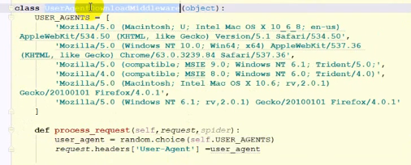
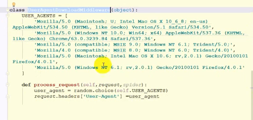
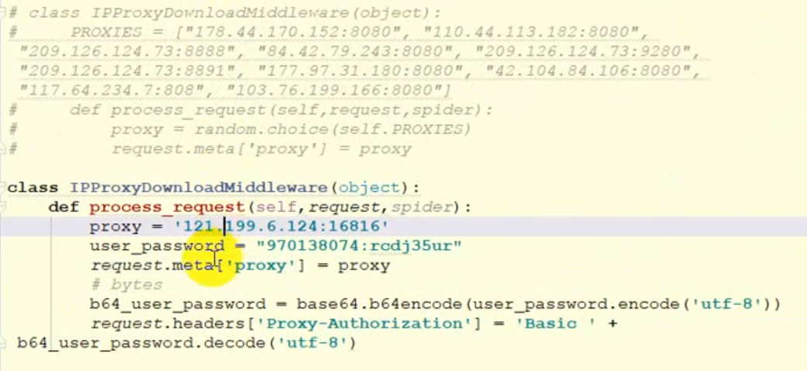
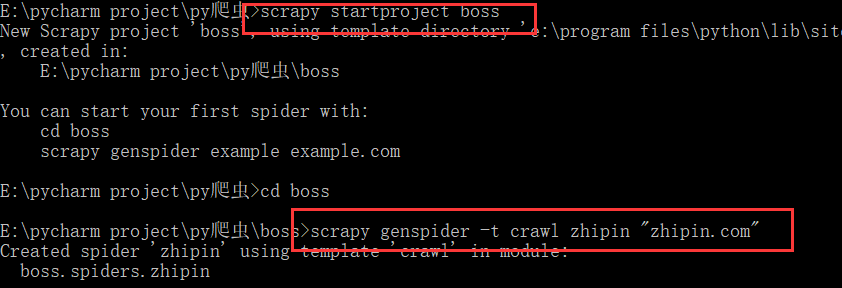
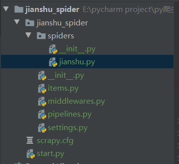

下载器中间件middleware主要有两个类

```
process_request(spider,request)
process_response()
```

使用随机请求头请求url



使用随机ip代理



使用独享代理ip访问



创建爬取boss直聘网的项目使用crawl模板



全站爬取简书网

爬取规则

```python
    rules = (
        Rule(LinkExtractor(allow=r'.*/p/[0-9a-z]{12}.*'), callback='parse_detail', follow=True),
    )
    # allow 采用正则表达式的方式 .*表示可有可无
```


采用scrapy shell 检验我们的xpath语法是否准确

```python
# 进入项目根目录
E:\pycharm project\py爬虫\jianshu_spider>scrapy shell https://www.jianshu.com/p/2904e60b8e50
```

用xpath解析页面

```python
In [3]: title = response.xpath("//h1[@class='_1RuRku']//text()").get()

In [4]: title
Out[4]: '一位加拿大奶爸教育“熊孩子”的札记'
```

采用selenium和webdriver和scrapy和mysql的方式爬取信息

项目结构



jianshu.py

```python
# -*- coding: utf-8 -*-
import scrapy
from scrapy.linkextractors import LinkExtractor
from scrapy.spiders import CrawlSpider, Rule

from jianshu_spider.items import ArticleItem


class JianshuSpider(CrawlSpider):
    name = 'jianshu'
    allowed_domains = ['jianshu.com']
    start_urls = ['https://www.jianshu.com/']

    rules = (
        Rule(LinkExtractor(allow=r'.*/p/[0-9a-z]{12}.*'), callback='parse_detail', follow=True),
    )

    def parse_detail(self, response):
        # item['domain_id'] = response.xpath('//input[@id="sid"]/@value').get()
        # item['name'] = response.xpath('//div[@id="name"]').get()
        # item['description'] = response.xpath('//div[@id="description"]').get()
        title = response.xpath("//h1[@class='_1RuRku']//text()").get()
        author = response.xpath("//span[@class='_22gUMi']/text()").get()
        pub_time = response.xpath("//div[@class='s-dsoj']//time/text()").get()
        article_id = response.url.split("/")[-1]
        origin_url = response.url
        content = response.xpath("//article[@class='_2rhmJa']").get()
        item = ArticleItem(
            title=title,
            article_id=article_id, origin_url=origin_url, author=author, content=content, pub_time=pub_time
        )
        yield item

```

items

```python
# -*- coding: utf-8 -*-

# Define here the models for your scraped items
#
# See documentation in:
# https://docs.scrapy.org/en/latest/topics/items.html
import scrapy

class ArticleItem(scrapy.Item):
    # define the fields for your item here like:
    # name = scrapy.Field()
    title = scrapy.Field()
    content = scrapy.Field()
    article_id = scrapy.Field()
    origin_url = scrapy.Field()
    author = scrapy.Field()
    pub_time = scrapy.Field()


```

middlewares.py 中间件

```python
# -*- coding: utf-8 -*-

# Define here the models for your spider middleware
#
# See documentation in:
# https://docs.scrapy.org/en/latest/topics/spider-middleware.html

from scrapy import signals
from selenium import webdriver
import time
from scrapy.http.response.html import HtmlResponse

class JianshuSpiderSpiderMiddleware(object):
    # Not all methods need to be defined. If a method is not defined,
    # scrapy acts as if the spider middleware does not modify the
    # passed objects.

    @classmethod
    def from_crawler(cls, crawler):
        # This method is used by Scrapy to create your spiders.
        s = cls()
        crawler.signals.connect(s.spider_opened, signal=signals.spider_opened)
        return s

    def process_spider_input(self, response, spider):
        # Called for each response that goes through the spider
        # middleware and into the spider.

        # Should return None or raise an exception.
        return None

    def process_spider_output(self, response, result, spider):
        # Called with the results returned from the Spider, after
        # it has processed the response.

        # Must return an iterable of Request, dict or Item objects.
        for i in result:
            yield i

    def process_spider_exception(self, response, exception, spider):
        # Called when a spider or process_spider_input() method
        # (from other spider middleware) raises an exception.

        # Should return either None or an iterable of Request, dict
        # or Item objects.
        pass

    def process_start_requests(self, start_requests, spider):
        # Called with the start requests of the spider, and works
        # similarly to the process_spider_output() method, except
        # that it doesn’t have a response associated.

        # Must return only requests (not items).
        for r in start_requests:
            yield r

    def spider_opened(self, spider):
        spider.logger.info('Spider opened: %s' % spider.name)


class JianshuSpiderDownloaderMiddleware(object):
    # Not all methods need to be defined. If a method is not defined,
    # scrapy acts as if the downloader middleware does not modify the
    # passed objects.
    
    # 创建driver使用selenium
    def __init__(self):
        self.driver = webdriver.Chrome(executable_path="E:\Program Files\chromedriver\chromedriver.exe")

    @classmethod
    def from_crawler(cls, crawler):
        # This method is used by Scrapy to create your spiders.
        s = cls()
        crawler.signals.connect(s.spider_opened, signal=signals.spider_opened)
        return s

    def process_request(self, request, spider):
        # Called for each request that goes through the downloader
        # middleware.

        # Must either:
        # - return None: continue processing this request
        # - or return a Response object
        # - or return a Request object
        # - or raise IgnoreRequest: process_exception() methods of
        #   installed downloader middleware will be called
        # 将pagesource返回解析
        # 返回response对象
        self.driver.get(request.url)
        time.sleep(1)
        source = self.driver.page_source
        response = HtmlResponse(url=self.driver.current_url, body=source, request=request, encoding='utf-8')
        return response

    def process_response(self, request, response, spider):
        # Called with the response returned from the downloader.

        # Must either;
        # - return a Response object
        # - return a Request object
        # - or raise IgnoreRequest
        return response

    def process_exception(self, request, exception, spider):
        # Called when a download handler or a process_request()
        # (from other downloader middleware) raises an exception.

        # Must either:
        # - return None: continue processing this exception
        # - return a Response object: stops process_exception() chain
        # - return a Request object: stops process_exception() chain
        pass

    def spider_opened(self, spider):
        spider.logger.info('Spider opened: %s' % spider.name)

```

pipelines.py 下载器,采用我们自己写的下载器

```python
class JianshuTwistedPipeline(object):
    def __init__(self):
        dbparams = {
            'host': '127.0.0.1',
            'port': 3306,
            'user': 'root',
            'password': 'root',
            'database': 'jianshu_article',
            'charset': 'utf8',
            'cursorclass': cursors.DictCursor # 游标
        }
        # 使用scrapy的Twiste创建池
        self.dbpool = adbapi.ConnectionPool('pymysql', **dbparams)
        self._sql = None

    @property
    def sql(self):
        if not self._sql:
            self._sql = '''
                insert into article values(null,%s,%s,%s,%s,%s,%s)
            '''
            return self._sql
        return self._sql

    def process_item(self, item, spider):
        defer = self.dbpool.runInteraction(self.insert_item, item)
		# 
        defer.addErrback(self.handle_error, item, spider)

    def insert_item(self, cursor, item):
        # 执行sql语句
        cursor.execute(self.sql,
                            (item['title'], item['author'], item['pub_time'], item['article_id'], item['origin_url'], item['content']))

    def handle_error(self, error, item, spider):
        print("="*10+"error"+"="*10)
        print(error)
        print("="*10+"error"+"="*10)
```


