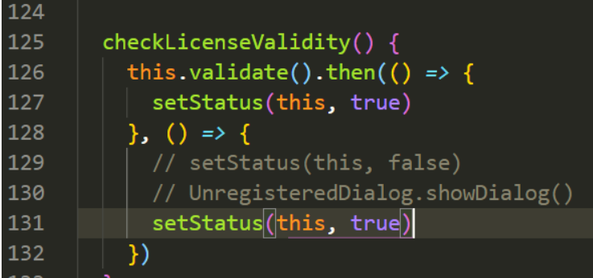
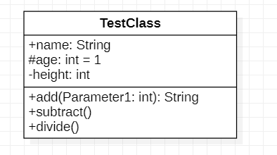
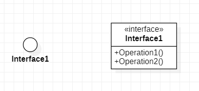
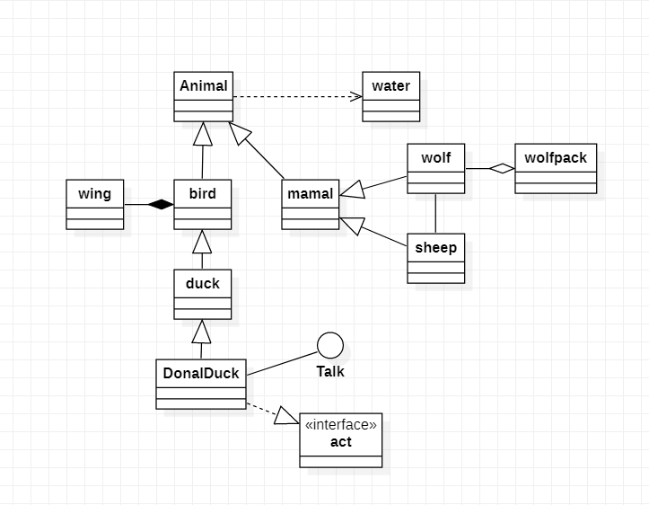

UML类图用来表示类之间的关系: 采用starUML软件,下载安装,安装node.js,配置环境变量,配置 npm的镜像:```npm config set registry https://registry.npm.taobao.org ```安装asar,```npm install -g asar```解压程序目录下的resources的app.asar,需要管理员权限```copy app.asar app.asar.bak;mkdir TMP; asar extract app.asar TMP;cd TMP/src/engin;修改license-manager.js文件;注释掉UnregisteredDialog.showDialog();修改setStatus(this,true);打包替换app.asar;asar pack TMP app.asar;破解成功```





访问权限: + 表示public; - 表示 private; # 表示 protected; ~ 表示package 下划线表示static,斜体表示abstract; : 表示变量类型或方法的返回值;= 表示默认值.

接口: 



关系:



 